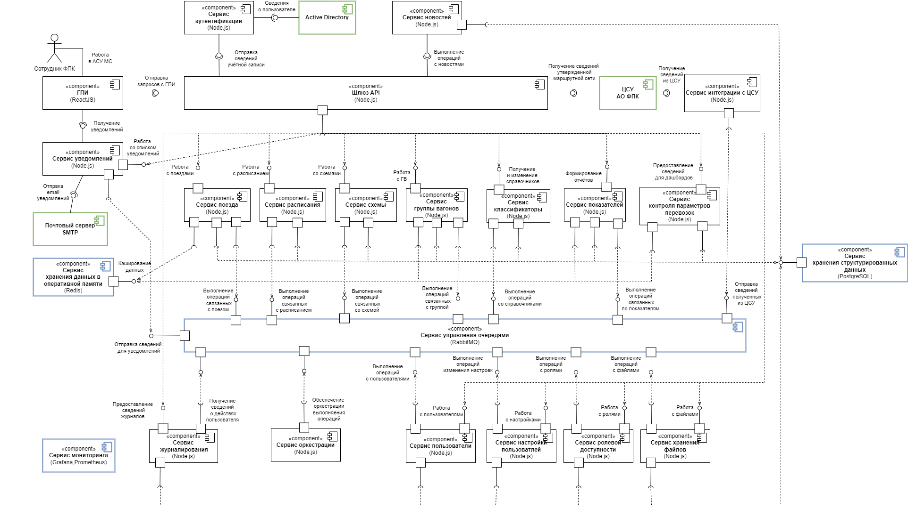

# Описание архитектуры

## UML Component diagram

### Формирование маршрутной сети движения поездов

**Легенда:**

Федеральная пассажирская компания (ФПК) — основной оператор пассажирских перевозок РЖД — разрабатывает перспективную маршрутную сеть на трёхлетний период, включая планирование "ниток" (базовых маршрутов поездов с расписанием и техническими параметрами) и формирование групп вагонов. При этом группы вагонов могут создаваться как самой ФПК, так и сторонними перевозчиками, после чего компания комбинирует их в схемы поездов — конкретные конфигурации составов. Один поезд может иметь несколько схем с разной периодичностью, что позволяет гибко адаптироваться к сезонным изменениям спроса.

#### Диаграмма

#### Описание

<table>
    <tr>
        <th>№</th>
        <th>Компонент</th>
        <th>Технология</th>
        <th>Описание</th>
    </tr>
    <tr>
        <td>1</td>
        <td>ГПИ</td>
        <td>ReactJS</td>
        <td>Предоставление пользователю графического интерфейса для взаимодействия с системой</td>
    </tr>
    <tr>
        <td>2</td>
        <td>Сервис аутентификации</td>
        <td>Node.js</td>
        <td>
            <ul>
                <li> Подтверждение личности пользователя
                <li> Управление сессиями
                <li> Получение сведений о пользователе из AD
            </ul>
        </td>
    </tr>
    <tr>
        <td>3</td>
        <td>Сервис новостей</td>
        <td>Node.js</td>
        <td>
            <ul>
                <li> Публикация новостей в новостной ленте
                <li> Публикация инструкций
                <li> Публикация вопросов рубрики FAQ
            </ul>
        </td>
    </tr>
    <tr>
        <td>4</td>
        <td>Шлюз API</td>
        <td>Node.js, Apollo Federation</td>
        <td>
            <ul>
                <li> Объединение схем сервисов в одну схему GraphQL
                <li> Получение запросов
                <li> Распределение запросов между сервисами
            </ul>
        </td>
    </tr>
    <tr>
        <td>5</td>
        <td>Сервис уведомлений</td>
        <td>Node.js, Apollo GraphQL</td>
        <td>
            <ul>
                <li> Отправка уведомлений пользователю в ЛК
                <li> Отправка уведомлений на email
            </ul>
        </td>
    </tr>
    <tr>
        <td>6</td>
        <td>Сервис поезда</td>
        <td>Node.js, Apollo GraphQL</td>
        <td>
            <ul>
                <li> Создание поездов
                <li> Предоставление сведений о поездах
                <li> Удаление поездов
                <li> Редактирование поездов
                <li> Согласование поездов отдельными подразделениями
                <li> Утверждение поездов
                <li> Предоставление списка поездов
                <li> Формирование выгрузок поездов в файл
            </ul>
        </td>
    </tr>
    <tr>
        <td>7</td>
        <td>Сервис расписания</td>
        <td>Node.js, Apollo GraphQL</td>
        <td>
            <ul>
                <li> Парсинг информации о расписании из файла
                <li> Предоставление сведений о расписании
                <li> Редактирование расписаний
                <li> Предоставление сведений о трафаретах расписания
                <li> Формирования выгрузок расписания в файл
                <li> Копирование расписания из другого поезда
                <li> Контроль занятости ниток
                <li> Формирование участков обслуживания локомотивов и локомотивных бригад
            </ul>
        </td>
    </tr>
    <tr>
        <td>8</td>
        <td>Сервис схемы</td>
        <td>Node.js, Apollo GraphQL</td>
        <td>
            <ul>
                <li> Формирование схем поездов из групп вагонов
                <li> Формирование выгрузок схем в файл
                <li> Внесение изменений в схемы
                <li> Управление временем перестоя
                <li> Управление периодичностью курсирования поезда с данной схемой
            </ul>
        </td>
    </tr>
    <tr>
        <td>9</td>
        <td>Сервис группы вагонов</td>
        <td>Node.js, Apollo GraphQL</td>
        <td>
            <ul>
                <li> Формирование групп вагонов
                <li> Формирование сведений о вагонах
                <li> Формирование графика оборота группы вагонов
                <li> Управление периодичностью группы
            </ul>
        </td>
    </tr>
    <tr>
        <td>9</td>
        <td>Сервис классификаторы</td>
        <td>Node.js, Apollo GraphQL</td>
        <td>
            <ul>
                <li> Формирование сведений справочников
                <li> Версионирование записей
            </ul>
        </td>
    </tr>
    <tr>
        <td>10</td>
        <td>Сервис показателей</td>
        <td>Node.js, Apollo GraphQL</td>
        <td>
            <ul>
                <li> Формирование отчетов по поездам
                <li> Формирование отчетов по группам вагонов
            </ul>
        </td>
    </tr>
    <tr>
        <td>11</td>
        <td>Сервис контроля параметров перевозок</td>
        <td>Node.js, Apollo GraphQL</td>
        <td>
            <ul>
                <li> Формирование сведений о свободных местах по направлениям
                <li> Формирования сведений об использовании вместимости по схемам и типам вагонов
                <li> Формирования сведений о местоположении вагонов
            </ul>
        </td>
    </tr>
    <tr>
        <td>12</td>
        <td>Сервис интеграции с ЦСУ</td>
        <td>Node.js</td>
        <td>
            <ul>
                <li> Загрузка справочников из ЦСУ ФПК
                <li> Загрузка сведений о местоположении вагонов
                <li> Загрузка сведений об использовании вместимости
                <li> Загрузка сведений о свободных местах по направлениям
            </ul>
        </td>
    </tr>
    <tr>
        <td>13</td>
        <td>Сервис хранения данных в оперативной памяти</td>
        <td>Redis</td>
        <td>
            <ul>
                <li> Хранение кэшей
            </ul>
        </td>
    </tr>
    <tr>
        <td>14</td>
        <td>Сервис управления очередями</td>
        <td>RabbitMQ</td>
        <td>
            <ul>
                <li> Обеспечение гарантированной доставки сообщений при коммуникации сервисов
            </ul>
        </td>
    </tr>
    <tr>
        <td>15</td>
        <td>Сервис хранения структурированных данных</td>
        <td>PostgreSQL</td>
        <td>
            <ul>
                <li> Хранение БД поездов
                <li> Хранение БД расписаний
                <li> Хранение БД групп вагонов
                <li> Хранение БД показателей
                <li> Хранение БД контроля схем
                <li> Хранение БД пользователей
            </ul>
        </td>
    </tr>
    <tr>
        <td>16</td>
        <td>Сервис мониторинга</td>
        <td>Grafana,Prometheus</td>
        <td>
            <ul>
                <li> Агрегация логов сервисов
                <li> Агрегация метрик сервисов
                <li> Визуализация логов и метрик сервисов в виде дашбордов
            </ul>
        </td>
    </tr>
    <tr>
        <td>17</td>
        <td>Сервис журналирования</td>
        <td>Node.js</td>
        <td>
            <ul>
                <li> Журналирования действий пользователей
                <li> Предоставление сведений для адита действий
            </ul>
        </td>
    </tr>
    <tr>
        <td>18</td>
        <td>Сервис оркестрации</td>
        <td>Node.js</td>
        <td>
            <ul>
                <li> Управление процессами выполнения распределенных транзакций
            </ul>
        </td>
    </tr>
    <tr>
        <td>19</td>
        <td>Сервис пользователи</td>
        <td>Node.js, Apollo GraphQL</td>
        <td>
            <ul>
                <li> Создание пользователей
                <li> Изменение сведений о пользователях
                <li> Блокировка/разблокировка пользователей
            </ul>
        </td>
    </tr>
    <tr>
        <td>20</td>
        <td>Сервис ролевой доступности</td>
        <td>Node.js, Apollo GraphQL</td>
        <td>
            <ul>
                <li> Назначение ролей пользователей
                <li> Назначение филиалов пользователей
            </ul>
        </td>
    </tr>
    <tr>
        <td>21</td>
        <td>Сервис хранения файлов</td>
        <td>Node.js, Apollo GraphQL</td>
        <td>
            <ul>
                <li> Управление загрузкой файлов
                <li> Управление извлечением файлов
            </ul>
        </td>
    </tr>

</table>