# Моделирование бизнес-процессов

## 1. BPMN

### 1.1 Размещение продукции в демонстрационно-дегустационных павильонах

**Легенда:**

Экспортер продукции агропромышленного комплекса, будь то юридическое лицо или индивидуальный предприниматель, заинтересован в расширении рынка сбыта и стремится продавать свою продукцию на рынках других стран. Для продвижения своей продукции он планирует использовать демонстрационно-дегустационные павильоны, расположенные за границей, которые посещают потенциальные импортеры в рамках различных мероприятий и выставок. Российский экспортный центр (РЭЦ) предлагает услуги по размещению и продвижению продукции на зарубежных рынках с целью популяризации товаров агропромышленного комплекса российского производства. В каждой стране павильоном управляет организация-оператор, имеющая договор с РЭЦ. Все расходы на размещение и продвижение продукции берет на себя РЭЦ, в то время как обязанностью экспортера является доставка продукции в павильон.

#### Бизнес-процесс (as-is)

##### Схема

.svg)

##### Описание

    
Размещение продукции в демонстрационно-дегустационных павильонах

    <table>
        <tr>
            <th>Шаг</th>
            <th>Наименование</th>
            <th>Участники</th>
            <th>Описание действий</th>
            <th>Входящие данные</th>
            <th>Исходящие данные</th>
        </tr>
        <tr>
            <td>1</td>
            <td>Собрать комплект документов</td>
            <td>Экспортёр</td>
            <td>Организация экспортер подготавливает пакет документов о собственной деятельности</td>
            <td>
                -
            </td>
            <td>
                Пакет документов:
                <ul>
                    <li> выписка из ЕГРЮЛ
                    <li> заверенные копии сертификатов соответствия
                    <li> справка подтверждающая отсутствие задолженности по налогам, просроченной задолженности по возврату средств в федеральный бюджет, не находится в стадии ликвидации и реорганизации
                </ul>
            </td>
        </tr>
        <tr>
            <td>2</td>
            <td>Подать заявку</td>
            <td>Экспортёр</td>
            <td>Организация экспортер заполняет заявку по форме РЭЦ</td>
            <td>
                -
            </td>
            <td>
                Заявка
            </td>
        </tr>
        <tr>
            <td>3</td>
            <td>Проверить комплект документов</td>
            <td>РЭЦ</td>
            <td>Сотрудник РЭЦ проверяет корректность заполнения заявки и достоверность предоставленных сведений</td>
            <td>
                -
            </td>
            <td>
                Решение по корректности подачи документов
            </td>
        </tr>
        <tr>
            <td>4</td>
            <td>Отправить уведомление об отказе</td>
            <td>РЭЦ</td>
            <td>Сотрудник РЭЦ готовит письмо с уведомлением об отказе в услуге с указанием причины отказа</td>
            <td>
                Решение по корректности подачи документов
            </td>
            <td>
                Письмо с уведомлением об отказе
            </td>
        </tr>
        <tr>
            <td>5</td>
            <td>Провести экспертную оценку продукции</td>
            <td>РЭЦ</td>
            <td>Отсечение компаний, поставка продукции которых не возможна в страну нахождения павильона. Оценка потенциала продукции</td>
            <td>
                Заявка
            </td>
            <td>
                Протокол заседания, Решение по компании с оценками по продукции.
            </td>
        </tr>
        <tr>
            <td>6</td>
            <td>Провести экспертную оценку продукции</td>
            <td>Оператор павильона</td>
            <td>Отсечение компаний, поставка продукции которых не возможна в страну нахождения павильона. Оценка потенциала продукции. Определение квот на размещение</td>
            <td>
                Заявка
            </td>
            <td>
                Протокол заседания, Решение по компании с оценками по продукции.
            </td>
        </tr>
        <tr>
            <td>7</td>
            <td>Свести результаты оценки</td>
            <td>РЭЦ</td>
            <td>Объединение результатов оценки сотрудниками РЭЦ и сотрудниками Оператора павильона. Формирование отчёта</td>
            <td>
                <ul>
                    <li> Протокол оценки продукции от РЭЦ
                    <li> Протокол оценки продукции от Оператора павильона
                </ul>
            </td>
            <td>
                Сводный отчёт
            </td>
        </tr>
        <tr>
            <td>8</td>
            <td>Утвердить итоговую оценку</td>
            <td>Экспертная комиссия</td>
            <td>Проверка результатов оценки продукции. Оценка компании и вынесение итогового решения по заявке</td>
            <td>
                <ul>
                    <li> Сводный отчёт
                    <li> Заявка
                </ul>
            </td>
            <td>
                Итоговый протокол с решением по заявке
            </td>
        </tr>
        <tr>
            <td>9</td>
            <td>Отправить уведомление об отказе</td>
            <td>РЭЦ</td>
            <td>Сотрудник РЭЦ готовит письмо с уведомлением об отказе в услуге с указанием причины отказа</td>
            <td>
                Итоговый протокол с решением по заявке
            </td>
            <td>
                Письмо с уведомлением об отказе
            </td>
        </tr>
        <tr>
            <td>10</td>
            <td>Разместить протокол на сайте РЭЦ</td>
            <td>РЭЦ</td>
            <td>Выполняется публикация скан-копии протокола рассмотрения заявки на сайте РЭЦ</td>
            <td>
                Итоговый протокол с решением по заявке
            </td>
            <td>
                Опубликованный протокол
            </td>
        </tr>
        <tr>
            <td>11</td>
            <td>Направить письмо и проект соглашения экспортеру</td>
            <td>РЭЦ</td>
            <td>Сотрудник РЭЦ формирует проект соглашения о размещении продукции в павильоне. Проект соглашения письмом направляется экспортёру для подписания</td>
            <td>
                Итоговый протокол с решением по заявке
            </td>
            <td>
                Проект соглашения о размещении продукции
            </td>
        </tr>
        <tr>
            <td>12</td>
            <td>Информировать оператора об участнике (экспортере)</td>
            <td>РЭЦ</td>
            <td>Сотрудник РЭЦ направляет письмо со сведениями об экспортере, который желает разместить продукцию в павильоне</td>
            <td>
                Итоговый протокол с решением по заявке
            </td>
            <td>
                Информационное письмо
            </td>
        </tr>
        <tr>
            <td>13</td>
            <td>Принять решение о размещении продукции</td>
            <td>Экспортёр</td>
            <td>Экспортёр изучает соглашение и принимает решение о необходимости размещения продукции в павильоне</td>
            <td>
                Проект соглашения о размещении продукции
            </td>
            <td>
                Решение по соглашению
            </td>
        </tr>
        <tr>
            <td>14</td>
            <td>Отказаться от услуги</td>
            <td>Экспортёр</td>
            <td>Экспортёр уведомляет в устной или письменной форме об отказе от услуги</td>
            <td>
                Решение по соглашению
            </td>
            <td>
                Уведомление об отказе
            </td>
        </tr>
        <tr>
            <td>15</td>
            <td>Подписать соглашение</td>
            <td>Экспортёр</td>
            <td>Экспортёр подписывает проект соглашения и направляет его в РЭЦ</td>
            <td>
                Решение по соглашению
            </td>
            <td>
                Соглашение подписанное со стороны экспортёра
            </td>
        </tr>
        <tr>
            <td>16</td>
            <td>Подписать соглашение</td>
            <td>РЭЦ</td>
            <td>РЭЦ подписывает соглашение ранее подписанное экспортёром и отправляет экземпляр экспортёру</td>
            <td>
                Соглашение подписанное со стороны экспортёра
            </td>
            <td>
                Подписанное соглашение
            </td>
        </tr>
        <tr>
            <td>17</td>
            <td>Доставить продукцию в павильон</td>
            <td>Экспортёр</td>
            <td>Экспортер готовит партию продукции для размещения в павильоне и осуществляет доставку в павильон</td>
            <td>
                Подписанное соглашение
            </td>
            <td>
                Продукция доставленная в павильон
            </td>
        </tr>
        <tr>
            <td>18</td>
            <td>Подписать акт приемки-передачи продукции</td>
            <td>Экспортёр</td>
            <td>Экспортер подписывает акт приёмки передачи продукции оператору павильона. Указывает количество и срок годности по каждой продукции</td>
            <td>
                Подписанное соглашение 
            </td>
            <td>
                Акт приёмки-передачи подписанный экспортёром
            </td>
        </tr>
        <tr>
            <td>19</td>
            <td>Подписать акт приемки-передачи продукции</td>
            <td>Оператор павильона</td>
            <td>Оператор проверят соответствие фактически доставленной продукции и сведений указанных в акте. По результатам проверки подписывает акт</td>
            <td>
                Акт приёмки-передачи подписанный экспортёром 
            </td>
            <td>
                Подписанный Акт приёмки-передачи
            </td>
        </tr>
        <tr>
            <td>20</td>
            <td>Разместить продукцию на выставочном стенде</td>
            <td>Оператор павильона</td>
            <td>Оператор размещает продукцию на стенде в выставочном зале и начинает осуществление продвижение продукции</td>
            <td>
                Продукция доставленная в павильон 
            </td>
            <td>
                Продукция размещенная в павильоне
            </td>
        </tr>
        <tr>
            <td>21</td>
            <td>Отправить скан Акта в РЭЦ</td>
            <td>Экспортёр</td>
            <td>Экспортёр снимает скан копию акта приёмки-передачи продукции в павильон и отправляет скан в РЭЦ</td>
            <td>
                Подписанный Акт приёмки-передачи 
            </td>
            <td>
                Скан-копия Акта
            </td>
        </tr>
        <tr>
            <td>22</td>
            <td>Передать сведения в учет</td>
            <td>РЭЦ</td>
            <td>Передать сведения об оказании учета в отдел ведения статистики</td>
            <td>
                Скан-копия Акта 
            </td>
            <td>
                Сведения об оказании услуги
            </td>
        </tr>
    </table>

#### Бизнес-процесс (to-be)

##### Полная схема

.svg)

##### Схема по частям

    
Часть 1

.part1.svg)

    
Часть 2

.part2.svg)

    
Часть 3

.part3.svg)

    
Часть 4

.part4.svg)

    
Часть 5

.part5.svg)

### 1.2 Обеспечение техническими средствами реабилитации

**Легенда:**

В Фонд «Защитники Отечества» поступает информация об инвалидах, нуждающихся в содействии по предоставлению технических средств реабилитации (ТСР), как в ходе личных обращений, так и из других источников, таких как СМИ, социальные сети и обращения органов исполнительной власти. Фонд оказывает помощь в подготовке необходимых документов, а также обеспечивает сопровождение процесса выполнения обращения инвалида и помогает решать возникающие проблемные ситуации.

#### Бизнес-процесс (as-is)

##### Схема

##### Описание

    
Обеспечение техническими средствами реабилитации

    <table>
        <tr>
            <th>№</th>
            <th>Наименование</th>
            <th>Участники</th>
            <th>Описание действий</th>
            <th>Входящие данные</th>
            <th>Исходящие данные</th>
        </tr>
        <tr>
            <td>E.1.</td>
            <td>Получена задача</td>
            <td>Социальный координатор</td>
            <td>Стартовое событие. Социальный координатор получает задачу на оказание содействия в получении технических средств реабилитации</td>
            <td>Задача оказания услуги по обращению Клиента</td>
            <td>-</td>
        </tr>
        <tr>
            <td>1.</td>
            <td>Информировать Клиента</td>
            <td>Социальный координатор</td>
            <td>Социальный координатор информирует Клиента о способах и месте подачи Обращения для получения ТСР</td>
            <td>Сведения о Клиенте</td>
            <td>Сведения о месте и способах подачи Обращения</td>
        </tr>
        <tr>
            <td>2.</td>
            <td>Содействовать в подаче Обращения</td>
            <td>Социальный координатор</td>
            <td>Социальный координатор оказывает Клиенту содействие (консультации) в подаче Обращения</td>
            <td>Сведения о Клиенте</td>
            <td>Планируемая дата подачи Обращения</td>
        </tr>
        <tr>
            <td>E.2.</td>
            <td>Дата подачи Обращения</td>
            <td>-</td>
            <td>Дата подачи Обращения, которая была предварительно запланирована Клиентом</td>
            <td>-</td>
            <td>-</td>
        </tr>
        <tr>
            <td>3.</td>
            <td>Проверить подачу Обращения</td>
            <td>Социальный координатор</td>
            <td>Социальный координатор связывается с Клиентом по телефону для получения сведений о результатах подачи Обращения</td>
            <td>Сведения о Клиенте</td>
            <td>Сведения о подаче Обращения Планируемая дата получения ТСР</td>
        </tr>
        <tr>
            <td>4.</td>
            <td>Уточнить дату подачи Обращения</td>
            <td>Социальный координатор</td>
            <td>В случае если Клиент еще не подал Обращение, социальный координатор уточняет плановую дату подачи Обращения Клиентом</td>
            <td>Сведения о подаче Обращения</td>
            <td>Дата подачи Обращения</td>
        </tr>
        <tr>
            <td>E.3.</td>
            <td>Отказ Клиента</td>
            <td>-</td>
            <td>Конечное событие процесса В случае отказа Клиента от получения услуги</td>
            <td>-</td>
            <td>-</td>
        </tr>
        <tr>
            <td>5.</td>
            <td>Проверить получение ТСР</td>
            <td>Социальный координатор</td>
            <td>Социальный координатор связывается с Клиентом по телефону для получения сведений о получении ТСР</td>
            <td>Сведения о Клиенте</td>
            <td>Сведения о получении ТСР</td>
        </tr>
        <tr>
            <td>6.</td>
            <td>Уточнить дату получения ТСР</td>
            <td>Социальный координатор</td>
            <td>В случае если Клиент еще не получил ТСР, социальный координатор уточняет плановую дату получения</td>
            <td>Сведения о получении ТСР</td>
            <td>Дата получения ТСР</td>
        </tr>
        <tr>
            <td>7.</td>
            <td>Зафиксировать факт получения ТСР</td>
            <td>Социальный координатор</td>
            <td>Социальный координатор фиксирует факт получения Клиентом ТСР. После чего услуга содействия считается оказанной</td>
            <td>Сведения о получении ТСР</td>
            <td>Отметка об оказании услуги</td>
        </tr>
    </table>

    
Формирование отчета по оказанию услуги

    <table>
        <tr>
            <th>№</th>
            <th>Наименование</th>
            <th>Участники</th>
            <th>Описание действий</th>
            <th>Входящие данные</th>
            <th>Исходящие данные</th>
        </tr>
        <tr>
            <td>E.6.</td>
            <td>Дата подготовки отчета (Еженедельно)</td>
            <td>-</td>
            <td>Стартовое событие. Наступает дата подготовки отчетности</td>
            <td>-</td>
            <td>-</td>
        </tr>
        <tr>
            <td>8.</td>
            <td>Подготовить отчет</td>
            <td>Социальный координатор</td>
            <td>Социальный координатор формирует отчет за прошедшую неделю о проделанной работе по содействию в предоставлении услуги Клиенту</td>
            <td>Сведения о ходе оказания услуги</td>
            <td>Еженедельный отчет</td>
        </tr>
        <tr>
            <td>E.7.</td>
            <td>Отчет подготовлен</td>
            <td>-</td>
            <td>Конечное событие процесса  Социальный координатор подготовил отчет</td>
            <td>Сведения о ходе оказания услуги</td>
            <td>Еженедельный отчет</td>
        </tr>
    </table>

    
Решение проблемных ситуаций

    <table>
        <tr>
            <th>№</th>
            <th>Наименование</th>
            <th>Участники</th>
            <th>Описание действий</th>
            <th>Входящие данные</th>
            <th>Исходящие данные</th>
        </tr>
        <tr>
            <td>E.8.</td>
            <td>Возникла проблема с оказанием услуги</td>
            <td>-</td>
            <td>Стартовое событие. Возникла проблема с оказанием услуги, которую социальный координатор не может решить самостоятельно</td>
            <td>-</td>
            <td>-</td>
        </tr>
        <tr>
            <td>8.</td>
            <td>Подготовить отчет</td>
            <td>Социальный координатор</td>
            <td>Социальный координатор формирует отчет за прошедшую неделю о проделанной работе по содействию в предоставлении услуги Клиенту</td>
            <td>Сведения о ходе оказания услуги</td>
            <td>Еженедельный отчет</td>
        </tr>
        <tr>
            <td>9.</td>
            <td>Информировать руководителя</td>
            <td>Социальный координатор</td>
            <td>Социальный координатор информирует Регионального руководителя о возникших проблемах по оказанию услуги</td>
            <td>Сведения о возникшей проблеме</td>
            <td>Факт информирования руководителя</td>
        </tr>
        <tr>
            <td>10.</td>
            <td>Разрешить проблемную ситуацию</td>
            <td>Региональный руководитель филиала</td>
            <td>Региональный руководитель филиала собирает МВК для решения проблемных вопросов. По результатам МВК выносится решение по дальнейшим действиям для оказания услуги</td>
            <td>Сведения о возникшей проблеме</td>
            <td>Решение о дальнейших действия по предоставлению услуги</td>
        </tr>
        <tr>
            <td>11.</td>
            <td>Информировать соц. координатора</td>
            <td>Региональный руководитель филиала</td>
            <td>Региональный руководитель филиала информирует социального координатора о необходимых действиях для продолжения оказания услуги</td>
            <td>Решение о дальнейших действия по предоставлению услуги</td>
            <td>Факт информирования социального координатора</td>
        </tr>
        <tr>
            <td>E.9.</td>
            <td>Отчет подготовлен</td>
            <td>-</td>
            <td>Конечное событие процесса Социальный координатор подготовил отчет</td>
            <td>-</td>
            <td>-</td>
        </tr>
    </table>

---

## 2. UML Activity diagram

### Размещение продукции в демонстрационно-дегустационных павильонах

**Легенда:**

Процесс аналогичен текущему процессу описанному в п.1.1

