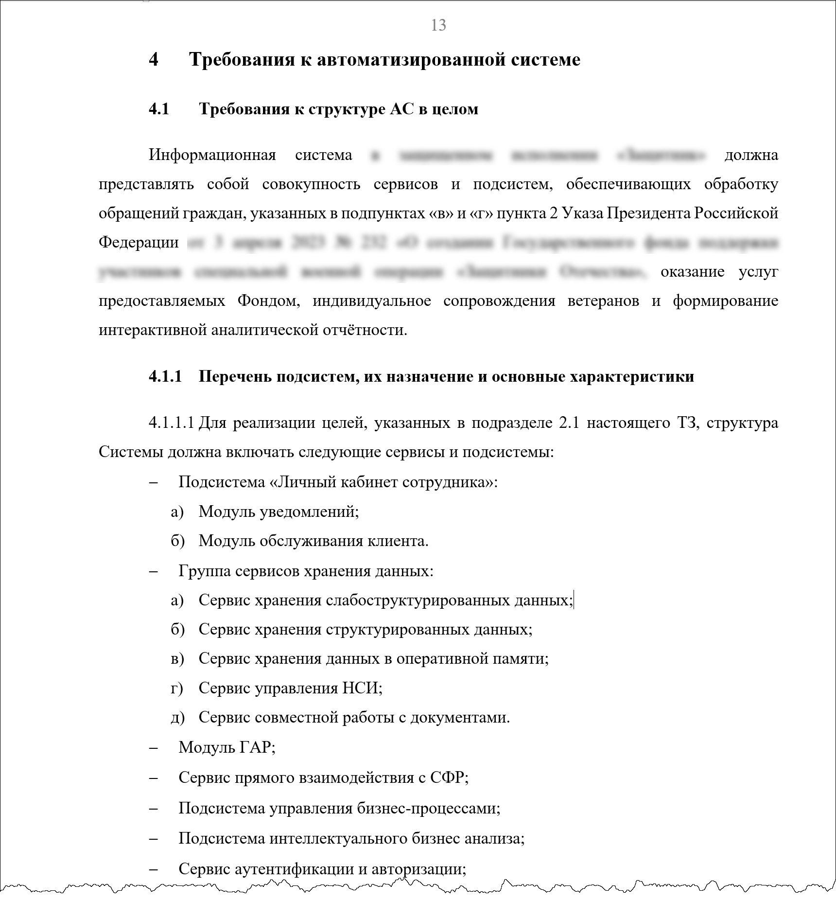
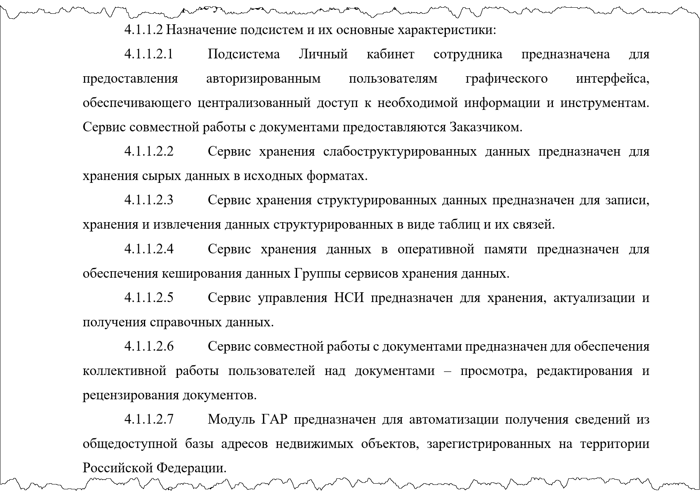
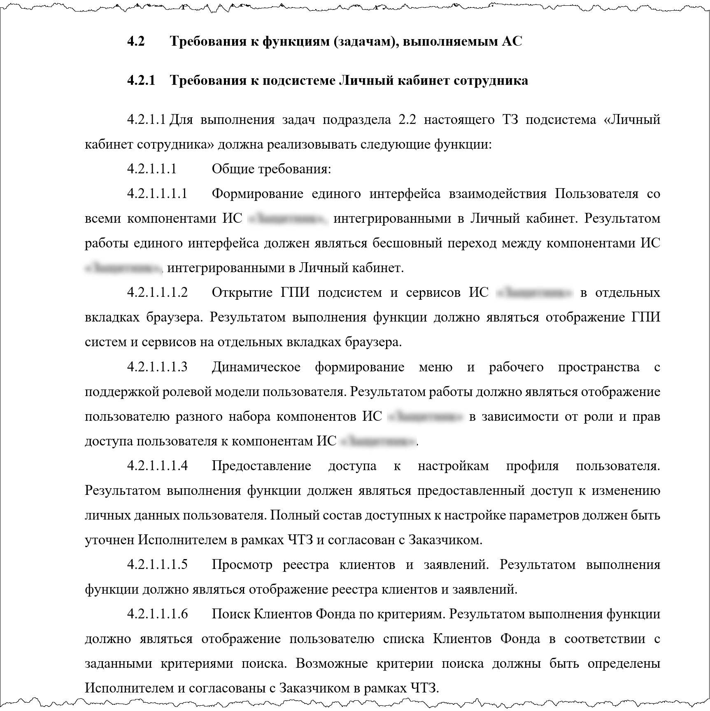
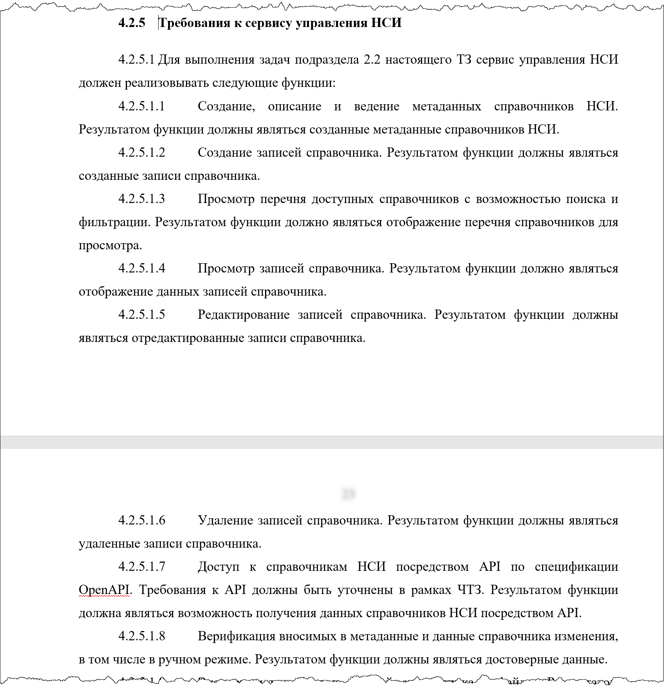
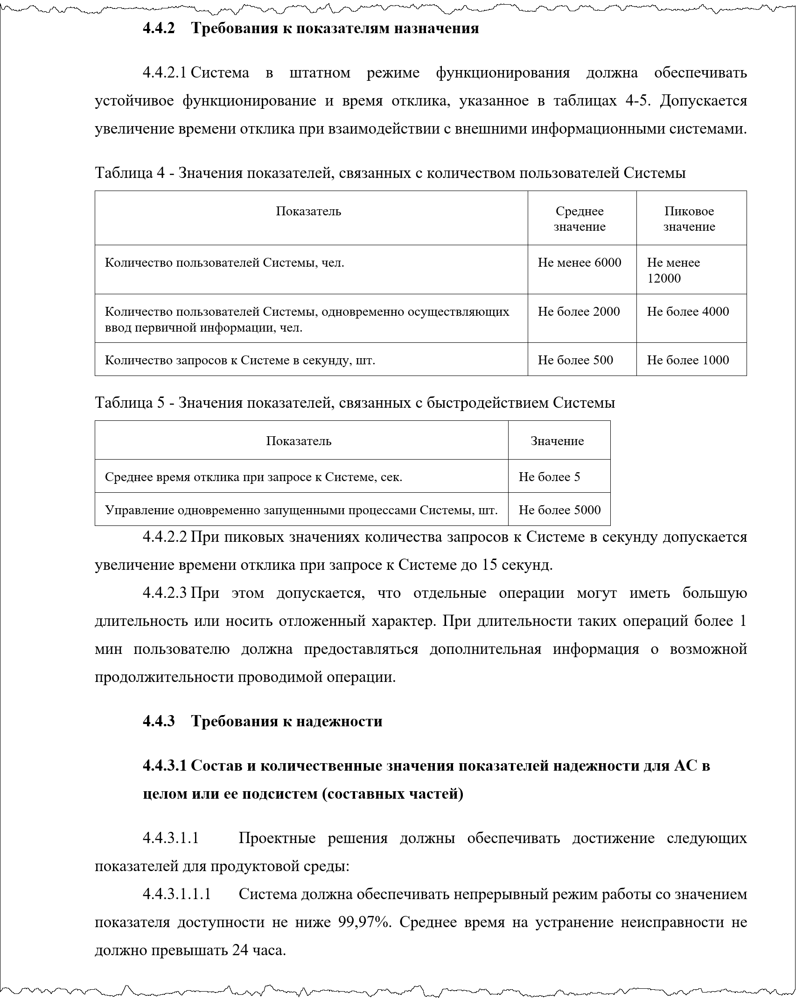

# Формализация требований

## 1. Требования по ГОСТ 34.602-2020

**Легенда:**
На основе результатов обследования организации заказчика, проведенных интервью и анализа нормативно-правовых актов, разрабатывается техническое задание для создания информационной системы. Эта система будет предназначена для автоматизации процессов подачи заявок на услуги, предоставляемые ветеранам боевых действий и членам их семей, а также для учета закупок лекарственных средств и медицинских изделий. Кроме того, система будет обеспечивать формирование аналитической отчетности по оказанным услугам.

### Требования к структуре системы

#### Перечень подсистем

#### Назначение подсистем

### Требования к функциям

#### Личный кабинет

#### Сервис управления НСИ

### Технические требования

#### Показатели назначения

---

## 2. Use case

**Легенда:**

Для технического задания на систему, указанную в п.1, приводится детализация некоторых функций

### Диаграмма

#### Модуль ведения информации

### Текстовое описание

#### Создать карточку договора

<table>
    <tr>
        <th align="left">Наименование</th>
        <td>Создать карточку договора</td>  
    </tr>
    <tr>
        <th align="left">Действующее лицо</th>
        <td>Сотрудник отдела закупок (Далее сотрудник)</td>  
    </tr>
    <tr>
        <th align="left">Цель</th>
        <td>Добавить новую карточку договора в реестр закупок</td>  
    </tr>
    <tr>
        <th align="left">Краткое описание</th>
        <td>Сотрудник просматривает реестр закупок и выбирает создать новую карточку договора. Сотрудник заполняет поля формы на основе бумажной версии договора, заполняет сведения о контрагенте, сведения о закупаемых лекарствах и медицинских изделиях</td>  
    </tr>
    <tr>
        <th align="left">Приоритет</th>
        <td>Средний</td>  
    </tr>
    <tr>
        <th align="left">Статус</th>
        <td>Требует согласования заказчика</td>  
    </tr>
    <tr>
        <th align="left">Предусловие</th>
        <td>Сотрудник просматривает реестр закупок</td>  
    </tr>
    <tr>
        <th align="left">Минимальные гарантии успеха</th>
        <td>-</td>  
    </tr>
    <tr>
        <th align="left">Гарантия успеха</th>
        <td>Создана новая карточка договора</td>  
    </tr>
    <tr>
        <th align="left">Триггер</th>
        <td>Подписан «бумажный» договор на выполнение закупки</td>  
    </tr>
    <tr>
        <th align="left">Основной сценарий</th>
        <td>
            1. Сотрудник выбирает создать новую карточку договора.  
            2. Система отображает экран «Сведения о договоре»(<a href="">Макет</a>).  
            3. Сотрудник на экране «Сведения о договоре» заполняет общие сведения о договоре и переходит к следующему экрану.  
            4. Система проверяет заполнение полей (см. табл. ФЛК), сохраняет договор в БД со статусом «Черновик» и отображает экран «Предмет закупки»(<a href="">Макет</a>).  
            5. Сотрудник на экране «Предмет закупки» выбирает добавить предмет закупки.  
            6. Система отображает экран с полями для заполнения сведений о предмете закупки.  
            7. Сотрудник заполняет поля и выбирает добавить закупку(<a href="">Макет</a>).  
            8. Система проверяет заполнение полей (см. табл. ФЛК) и отображает экран «Предмет закупки» с новой строкой по закупке(<a href="">Макет</a>).  
            9. Сотрудник повторяет шаги 5-8 необходимое количество раз и выбирает переход к следующему экрану.  
            10. Система сохраняет договор в БД со статусом «Черновик» и отображает экран «Проверка сведений» с итоговыми сведениями по договору(<a href="">Макет</a>)  
            11. Сотрудник подтверждает сведения внесенные сведения.  
            12. Система изменяет статус договора на «Действующий».
        </td>  
    </tr>
    <tr>
        <th align="left">Расширения</th>
        <td>
            4а. Обнаружена ошибка: 
                    4а1. Система отображает сообщение об ошибке (см. табл. ФЛК).  
                    4а2. Сотрудник вносит корректировки и переходит к следующему экрану.  
                    4а3. Выполняется переход к шагу 4 основного сценария.  
            5а.* Сотрудник выбрал вернуться на предыдущий экран: 
                    5а1. Выполняется возврат к предыдущему экрану формирования карточки договора.  
            5b.** Сотрудник выбрал отменить ввод данных: 
                    5b1. Система запрашивает подтверждение отмены формирования договора(<a href="">Макет</a>).  
                    5b2. Сотрудник подтверждает отмену формирования договора:  
                            5b2а. Сотрудник отказался от отмены:  
                                    5b2а1. Система отображает экран, с которого была инициирована отмена. 
                    5b3. Система отображает реестр закупок(<a href="">Макет</a>). Сохранение сведений текущего шага не выполняется.  
            5с. Сотрудник выбрал редактировать предмет закупки:  
                    5b1. Система отображает экран с полями для заполнения сведений о предмете закупки(<a href="">Макет</a>) и предзаполняет поля ранее введенными значениями.  
                    5с2. Сотрудник вносит корректировки и выбирает сохранить изменения.  
                    5с3. Выполняется переход к шагу 7 основного сценария.  
            5d. Сотрудник выбрал удалить закупку:  
                    5d1. Система запрашивает подтверждение удаления(<a href="">Макет</a>). 
                    5d2. Сотрудник подтверждает удаление. 
                            5d2а. Сотрудник отказался от удаления: 
                                    5d2а1. Система отображает экран «Предмет закупки» в исходном состоянии. 
                    5d3. Система удаляет закупку и отображает экран «Предмет закупки» без удалённой закупки. 
            8а. Обнаружена ошибка: 
                    8а1. Система отображает сообщение об ошибке (см. табл. ФЛК). 
                    8а2. Сотрудник вносит корректировки и переходит к следующему экрану. 
                    8а3. Выполняется переход к шагу 7 основного сценария. 
            *  (аналогично для 5а, 11а) 
            ** (аналогично для 5b, 9b, 11b) 
        </td>  
    </tr>
</table>

#### Распределить закупки по организациям

<table>
    <tr>
        <th align="left">Наименование</th>
        <td>Распределить закупки по организациям</td>  
    </tr>
    <tr>
        <th align="left">Действующее лицо</th>
        <td>Сотрудник отдела закупок (Далее сотрудник)</td>  
    </tr>
    <tr>
        <th align="left">Цель</th>
        <td>Распределить предметы закупки в филиалы фонда, аптеки или иные организации</td>  
    </tr>
    <tr>
        <th align="left">Краткое описание</th>
        <td>Сотрудник просматривает реестр закупок и выбирает один из предметов закупки. Далее сотрудник просматривает количество не распределённых предметов закупки и заполняет карточку распределения: указывает организацию и количество передаваемых предметов.</td>  
    </tr>
    <tr>
        <th align="left">Приоритет</th>
        <td>Средний</td>  
    </tr>
    <tr>
        <th align="left">Статус</th>
        <td>Требует согласования заказчика</td>  
    </tr>
    <tr>
        <th align="left">Предусловие</th>
        <td>Сотрудник просматривает реестр закупок</td>  
    </tr>
    <tr>
        <th align="left">Минимальные гарантии успеха</th>
        <td>-</td>  
    </tr>
    <tr>
        <th align="left">Гарантия успеха</th>
        <td>Выполнено распределение предметов закупки между организациями для передачи их клиентам</td>  
    </tr>
    <tr>
        <th align="left">Триггер</th>
        <td>Сотрудник выбрал просмотр предмета закупки</td>  
    </tr>
    <tr>
        <th align="left">Основной сценарий</th>
        <td>
            1. Сотрудник выбирает просмотреть предмет закупки.(<a href="">Макет</a>) 
            2. Система отображает общие сведения о предмете закупки и текущее распределение по организациям(<a href="">Макет</a>). 
            3. Сотрудник выбирает добавить распределение из Фонда в новую организацию.
            4. Система отображает модальное окно распределения предметов закупки в организацию(<a href="">Макет</a>).
            5. Сотрудник заполняет поля карточки, загружает скан-копию решения о передаче, сохраняет внесенные сведения.
            6. Система проверяет внесенные сведения (см табл. ФЛК), пересчитывает количество не распределенных предметов закупки, сохраняет введенные сведения в БД и отображает экран с общими сведениями о предмете закупки(<a href="">Макет</a>). 
        </td>  
    </tr>
    <tr>
        <th align="left">Расширения</th>
        <td>	
            3а. Сотрудник выбрал передачу из одной организации в другую: 
                    3а1. Система отображает модальное окно передачи предметов закупки(<a href="">Макет</a>). 
                    3а2. Сотрудник заполняет поля карточки передачи предметов закупки, загружает скан-копию решения передачи и сохраняет внесённые сведения. 
                    3а3. Система проверяет внесённые сведения (см табл. ФЛК), пересчитывает количество не распределённых предметов закупки в передающей и получающей организации сохраняет введенные сведения в БД и отображает экран с общими сведениями о предмете закупки(<a href="">Макет</a>). 
            3b. Сотрудник выбрал просмотреть сведения о предмете закупки в организации: 
                    3b1. Система отображает модальное окно просмотра сведений о предмете закупки в организации(<a href="">Макет</a>). 
                    3b2. Сотрудник завершает просмотр сведений: 
                            3b2а. Сотрудник выбрал редактировать операцию перераспределения: 
                                    3b2а1. Выполняется переход к шагу 3а1 расширенного сценария. 
                            3b2b. Сотрудник выбрал переход просмотра предметов закупки клиента по ссылке СНИЛС: 
                                    3b2b1. Выполняется переход к сценарию (<a href="">04.02.01.10. Просмотр карточки получателя</a>) 
                    3b3. Система отображает экран с общими сведениями о предмете закупки(<a href="">Макет</a>). 
        </td>  
    </tr>
</table>

---

## 3. User story

**Легенда:**
Представлена детализация некоторых пользовательских требований для приложения управления умным домом. Это приложение позволяет интегрировать несколько домов и различные умные устройства, а также объединять их в группы для более удобного управления.

### Создание учетной записи

<table>
    <tr>
        <th align="left">Наименование</th>
        <td>Создание учетной записи</td>
    </tr>
    <tr>
        <th align="left">Как</th>
        <td>Владелец дома</td>
    </tr>
    <tr>
        <th align="left">Я хочу</th>
        <td>Создать учетную запись</td>
    </tr>
    <tr>
        <th align="left">Чтобы</th>
        <td>Не потерять настройки приложения</td>
    </tr>
    <tr>
        <th align="left">Критерии приёмки</th>
        <td>
            <ul>
                <li> В приложении отображается сообщение об успешной регистрации
                <li> В приложении отображается сообщение, что пользователь уже зарегистрирован
                <li> В приложении отображается сообщение, что пароль слишком простой
            </ul>
        </td>
    </tr>
    <tr>
        <th align="left">Сценарии приёмки</th>
        <td>
            <b>Сценарий:</b> В приложении отображается сообщение об успешной регистрации 
            <b>Дано:</b> Пользователь ещё не зарегистрирован 
            <b>Когда</b> пользователь отправил запрос на регистрацию 
            <b>И</b> указал имя ${name} 
            <b>И</b> указал логин ${login} 
            <b>И</b> указал пароль ${password} 
            <b>И</b> подтвердил пароль ${password} 
            <b>И</b> приложение сохранило учётную запись 
            <b>Тогда</b> пользователю отображается уведомление «Вы успешно зарегистрировались» 
            <b>Примеры:</b> 
            <table>
                <tr>
                    <th>name</th>
                    <th>login</th>
                    <th>password</th>
                </tr>
                <tr>
                    <td>Иван Иванович</td>
                    <td>iivanov@gmail.com</td>
                    <td>Wg12345678</td>
                </tr>
                <tr>
                    <td>Петя</td>
                    <td>petrov@yandex.ru</td>
                    <td>Sf87654321</td>
                </tr>
            </table>
            

            <b>Сценарий:</b>В приложении отображается сообщение, что пользователь уже зарегистрирован 
            <b>Дано:</b> Пользователь с логином ${login} уже зарегистрирован 
            <b>Когда</b> пользователь отправил запрос на регистрацию 
            <b>И</b> указал имя ${name} 
            <b>И</b> указал логин ${login} 
            <b>И</b> указал пароль ${password} 
            <b>И</b> подтвердил пароль ${password} 
            <b>Тогда</b> пользователю отображается уведомление «Пользователь с таким логином уже существует» 
            <b>Примеры:</b> 
            <table>
                <tr>
                    <th>name</th>
                    <th>login</th>
                    <th>password</th>
                </tr>
                <tr>
                    <td>Ваня Федотов</td>
                    <td>iivanov@gmail.com</td>
                    <td>Wg11111111</td>
                </tr>
            </table>
            

            <b>Сценарий:</b>В приложении отображается сообщение, что пароль слишком простой 
            <b>Дано:</b> Пользователь ещё не зарегистрирован 
            <b>Когда</b> пользователь отправил запрос на регистрацию 
            <b>И</b> указал имя ${name} 
            <b>И</b> указал логин ${login} 
            <b>И</b> указал пароль ${password} 
            <b>И</b> подтвердил пароль ${password} 
            <b>Тогда</b> пользователю отображается уведомление «Пароль слишком простой. Пароль должен быть от 8 до 16 символов и содержать хотя бы одну строчную и прописную букву латинского алфавита» 
            <b>Примеры:</b> 
            <table>
                <tr>
                    <th>name</th>
                    <th>login</th>
                    <th>password</th>
                </tr>
                <tr>
                    <td>Ваня Федотов</td>
                    <td>iivanov@gmail.com</td>
                    <td>123</td>
                </tr>
            </table>
        </td>
    </tr>
</table>

### Создание комнаты

<table>
    <tr>
        <th align="left">Наименование</th>
        <td>Создание комнаты</td>
    </tr>
    <tr>
        <th align="left">Как</th>
        <td>Владелец дома</td>
    </tr>
    <tr>
        <th align="left">Я хочу</th>
        <td>Создать комнату</td>
    </tr>
    <tr>
        <th align="left">Чтобы</th>
        <td>Иметь возможность группировать устройства в комнате</td>
    </tr>
    <tr>
        <th align="left">Критерии приёмки</th>
        <td>
            <ul>
                <li> Можно добавить комнату
                <li> Можно выбрать тип комнаты с иконкой
            </ul>
        </td>
    </tr>
    <tr>
        <th align="left">Сценарии приёмки</th>
        <td>
            <b>Сценарий:</b>Добавить комнату 
            <b>Дано:</b>Дом выбран 
            <b>Когда</b> пользователь выбрал добавить новую комнату в доме 
            <b>Тогда</b> создаётся проект комнаты с наименованием «Комната » + ${порядковый номер} 
            <b>И</b> пользователю предлагается выбрать тип комнаты 
            

            <b>Сценарий:</b>Выбрать тип комнаты 
            <b>Дано:</b>Создан проект комнаты 
            <b>И</b> пользователю предложено выбрать тип комнаты 
            <b>Когда</b> пользователь выбирает ${roomType} 
            <b>Тогда</b> тип комнаты выбран 
            <b>И</b> пользователю предложено выбрать иконку комнаты 
            <b>Примеры:</b> 
            <table>
                <tr>
                    <th>roomType</th>
                </tr>
                <tr>
                    <td>Спальня</td>
                </tr>
                <tr>
                    <td>Кухня</td>
                </tr>
                <tr>
                    <td>Прихожая</td>
                </tr>
            </table>
        </td>
    </tr>
</table>