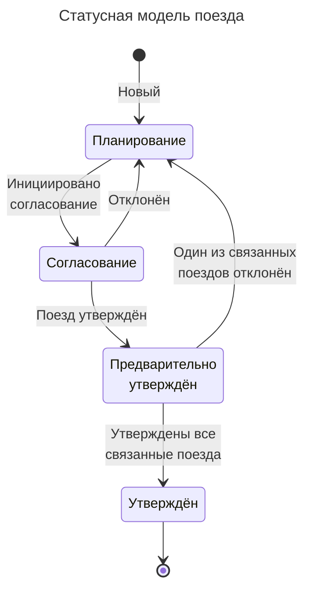
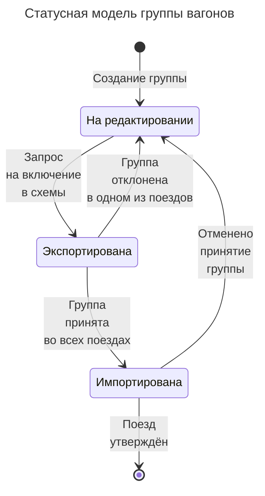

# Статусная модель и ее описание

##  UML State Machine diagram

### Размещение продукции в демонстрационно-дегустационных павильонах

**Легенда:**

Экспортер продукции агропромышленного комплекса, будь то юридическое лицо или индивидуальный предприниматель, заинтересован в расширении рынка сбыта и стремится продавать свою продукцию на рынках других стран. Для продвижения своей продукции он планирует использовать демонстрационно-дегустационные павильоны, расположенные за границей, которые посещают потенциальные импортеры в рамках различных мероприятий и выставок. Российский экспортный центр (РЭЦ) предлагает услуги по размещению и продвижению продукции на зарубежных рынках с целью популяризации товаров агропромышленного комплекса российского производства. В каждой стране павильоном управляет организация-оператор, имеющая договор с РЭЦ. Все расходы на размещение и продвижение продукции берет на себя РЭЦ, в то время как обязанностью экспортера является доставка продукции в павильон.

#### Диаграмма

<details>
    <summary>Code PlantUML</summary>

```plantuml
@startuml "Статусная модель заявки"

!include style.puml

skinparam maxMessageSize 25

state "Черновик" as draft #WhiteSmoke
draft: Создание новой заявки,\nСоздание заявки по образцу

state "В работе" as inProgress {
    state "Проводится проверка" as verification
    verification: Проверка на стоп-факторы (KYC);\n Получение сведений из внешних источников
    
    state "Принята к рассмотрению" as consideration
    consideration: Оценка продукции и расчет итогового балла
    
    state "Подписание соглашения" as agreement
    agreement: Формирование соглашения,\nуточнение сведений о продукции,\nподписание соглашения
    
    state "Публикация на сайте" as publication
    publication: Размещение сведений о продукции\nна сайте GoodFoodRussia.com
    
    state "Подписание акта" as act
    act: Внесение сведений\nо фактически полученной продукции,\nформирование акта, подписание акта
}

state "Завершена" as completed {
    state "Услуга оказана" as provided #PaleGreen
    state "Передана в учет" as registration #PaleGreen
    state "Заявка отклонена" as rejected 
    state "Отказ клиента" as refusal #Salmon
    state "Аннулирована" as cancelled
}

[*] --> draft: Заявка\nсоздана

draft --> verification: Заявка\nподписана
draft --> refusal: Клиент\nотказался\nот услуги
draft --> cancelled: Истекло\nвремя\nподписания

inProgress --> refusal: Клиент\nотказался\nот услуги

verification --> consideration: Проверка\nпройдена
verification --> rejected: Проверка\nне пройдена

consideration --> agreement: Получен\nпроходной\nбалл
consideration --> rejected: Не получен\nпроходной\nбалл

agreement --> publication: Подписано\nсоглашение
agreement --> refusal: Нарушен\nсрок\nподписания

publication --> act: Сведения отправлены на сайт

act --> provided: Подписан\nакт
act --> refusal: Акт\nне подписан

provided --> registration

registration --> [*]
rejected --> [*]
refusal --> [*]
cancelled --> [*]

@enduml
```
</details>


#### Описание

<details>
    <summary>Описание логики изменения статуса заявки и отправки уведомлений</summary>
    <table>
        <tr bgcolor="#e1ffe7">
            <th rowspan="2">Действие</th>
            <th colspan="2">Возможные значения</th>
            <th rowspan="2">Условия перехода</th>
            <th rowspan="2">Уведомления при изменении значения статуса</th>
        </tr>
        <tr bgcolor="#e1ffe7">
            <th>статуса</th>
            <th>подстатуса</th>
        </tr>
        <tr bgcolor="#f8f7f7">
            <td colspan="5"><b>Начало</b></td>
        </tr>
        <tr>
            <td>Создание заявки</td>
            <td>Черновик</td>
            <td>-</td>
            <td>Пользователь с соответствующими правами создал и сохранил заявку</td>
            <td>-</td>
        </tr>
        <tr bgcolor="#f8f7f7">
            <td colspan="5"><b>Статус: "Черновик"</b></td>
        </tr>
        <tr>
            <td>Подписание заявки</td>
            <td>В работе</td>
            <td>Проводится проверка</td>
            <td>Пользователь подписывает заявку УКЭП и отправляет в РЭЦ на проверку</td>
            <td>Уведомление пользователя(экспортёра) по email и push-уведомление в ЛК: о регистрации заявки с указанием регистрационного номера, даты регистрации и текущего статуса заявки</td>
        </tr>
        <tr>
            <td>Бездействие пользователя</td>
            <td>Завершена</td>
            <td>Аннулирована</td>
            <td>Заявка находится в статусе "Черновик" более N дней с даты создания</td>
            <td>Уведомление пользователя(экспортёра) по email и push-уведомление в ЛК: создавшего заявку</td>
        </tr>
        <tr>
            <td>Отказ клиента от услуги</td>
            <td>Завершена</td>
            <td>Отказ клиента</td>
            <td>Пользователь в личном кабинете выбрал "Отказаться от услуги"</td>
            <td>Уведомление пользователя(экспортёра) по email и push-уведомление в ЛК: об отказе от услуги с указанием регистрационного номера, даты регистрации заявки и отказа от услуги, а так же текущего статуса заявки</td>
        </tr>
            <td bgcolor="#f8f7f7"><b>Статус: "В работе"</b></td>
            <td bgcolor="#f8f7f7" colspan="4"><b>Подстатус: "Проводится проверка"</b></td>
        </tr>
        <tr>
            <td rowspan="2">Проверка организации-экспортёра (KYC и получение сведений из внешних источников)</td>
            <td>В работе</td>
            <td>Принята к рассмотрению</td>
            <td>Проверка организации-экспортёра завершилась успешно и организация допущена к участию</td>
            <td>-</td>
        <tr>
            <td>Завершена</td>
            <td>Заявка отклонена</td>
            <td>При проверке организации-экспортёра выявлен стоп-фактор. Организация не допущена к участию</td>
            <td>Уведомление пользователя(экспортёра) по email и push-уведомление в ЛК: об отказе в услуге с указанием причин отказа</td>
        </tr>
        </tr>
            <td bgcolor="#f8f7f7"><b>Статус: "В работе"</b></td>
            <td bgcolor="#f8f7f7" colspan="4"><b>Подстатус: "Принята к рассмотрению"</b></td>
        </tr>
        <tr>
            <td rowspan="2">Автоматическая оценка продукции и расчет итогового балла</td>
            <td>В работе</td>
            <td>Подписание соглашения</td>
            <td>По одной или более продукций, указанных в заявке, организация набрала необходимый проходной балл</td>
            <td> 
                <ul>
                <li> Уведомление пользователя(экспортёра) по email и push-уведомление в ЛК: об отборе организации для размещения в павильоне и необходимости подписать соглашение
                <li> Уведомление оператора павильона по email: о необходимости проконсультировать экспортёра по вопросам размещения продукции
                </ul>
            </td>
        <tr>
            <td>Завершена</td>
            <td>Заявка отклонена</td>
            <td>Вся продукция, указанная в заявке, набрала итоговый балл ниже проходного. Нет продукции к размещению в павильоне</td>
            <td>Уведомление пользователя(экспортёра) по email и push-уведомление в ЛК: об отказе в услуге с указанием причин отказа</td>
        </tr>
        </tr>
            <td bgcolor="#f8f7f7"><b>Статус: "В работе"</b></td>
            <td bgcolor="#f8f7f7" colspan="4"><b>Подстатус: "Подписание соглашения"</b></td>
        </tr>
        <tr>
            <td>Подписание соглашения</td>
            <td>В работе</td>
            <td>Публикация на сайте</td>
            <td>Пользователь подписывает соглашение и отправляет его в РЭЦ</td>
            <td>-</td>
        <tr>
            <td>Бездействие пользователя</td>
            <td>Завершена</td>
            <td>Отказ клиента</td>
            <td>Истекло N дней с даты формирования проекта соглашения. Соглашение не подписано</td>
            <td>
                <ul>
                    <li>Уведомление пользователя(экспортёра) по email и push-уведомление в ЛК: истечении срока подписания соглашения с указанием регистрационного номера, даты регистрации заявки, а так же текущего статуса заявки
                    <li>Уведомление клиентского менеджера РЭЦ по email: о нарушении сроков подписания соглашения с указанием организации и контактных данных
                </ul>
            </td>
        </tr>
        </tr>
            <td bgcolor="#f8f7f7"><b>Статус: "В работе"</b></td>
            <td bgcolor="#f8f7f7" colspan="4"><b>Подстатус: "Публикация на сайте"</b></td>
        </tr>
        <tr>
            <td>Заполнение дополнительных сведений о продукции для размещения на сайте GoodFoodRussia.com</td>
            <td>В работе</td>
            <td>Подписание акта</td>
            <td>Отправлены сведения для размещения на сайте. Или истекло время заполнения сведений</td>
            <td>Уведомление оператора павильона по email: о необходимости подписать акт приемки-передачи продукции</td>
        </tr>
        <tr>
            <td>Бездействие пользователя</td>
            <td>В работе</td>
            <td>Подписание акта</td>
            <td>Истекло время заполнения сведений</td>
            <td>Уведомление оператора павильона по email: о необходимости подписать акт приемки-передачи продукции</td>
        </tr>
        </tr>
            <td bgcolor="#f8f7f7"><b>Статус: "В работе"</b></td>
            <td bgcolor="#f8f7f7" colspan="4"><b>Подстатус: "Подписание акта"</b></td>
        </tr>
        <tr>
            <td rowspan="2">Доставка продукции в павильон подписание акта двумя сторонами</td>
            <td>Завершена</td>
            <td>Услуга оказана</td>
            <td>Акт подписан экспортёром</td>
            <td>Уведомление оператора павильона по email: о подписании акта экспортёром</td>
        </tr>
        <tr>
            <td>Завершена</td>
            <td>Услуга оказана</td>
            <td>Прошло более N дней с даты подписания акта оператором павильона. Акт не подписан экспортёром</td>
            <td>Уведомление клиентского менеджера РЭЦ по email: о нарушении сроков подписания акта с указанием организации и контактных данных</td>
        </tr>
        <tr>
            <td>Бездействие пользователя</td>
            <td>Завершена</td>
            <td>Отказ клиента</td>
            <td>Прошло более N дней с даты подписания соглашения экспортёром. Акт не подписан оператором павильона</td>
            <td>
                <ul>
                    <li> Уведомление клиентского менеджера РЭЦ по email: об истечении срока подписания акта оператором павильона с указанием организации экспортера и контактных данных
                    <li> Уведомление пользователя(экспортёра) по email и push-уведомление в ЛК: об истечении срока подписания акта с указанием регистрационного номера, даты регистрации заявки, а так же текущего статуса заявки 
                </ul>
            </td>
        </tr>
        </tr>
            <td bgcolor="#f8f7f7"><b>Статус: "Завершена"</b></td>
            <td bgcolor="#f8f7f7" colspan="4"><b>Подстатус: "Услуга оказана"</b></td>
        </tr>
        <tr>
            <td>Формирование отчёта экспортёра</td>
            <td>Завершена</td>
            <td>Передана в учёт</td>
            <td>Подписан отчёт экспортёра</td>
            <td>-</td>
        </tr>
        <tr>
            <td>Бездействие пользователя</td>
            <td>Завершена</td>
            <td>Передана в учёт</td>
            <td>Прошло более N дней с даты начала подачи отчётов. Отчет не направлен в РЭЦ</td>
            <td>Уведомление клиентского менеджера РЭЦ по email: об истечении срока подачи отчёта экспортёра с указанием организации и контактных данных</td>
        </tr>
        </tr>
            <td bgcolor="#f8f7f7"><b>Статус: "Завершена"</b></td>
            <td bgcolor="#f8f7f7" colspan="4"><b>Подстатус: "Аннулирована"</b> - не меняет значение</td>
        </tr>
        </tr>
            <td bgcolor="#f8f7f7"><b>Статус: "Завершена"</b></td>
            <td bgcolor="#f8f7f7" colspan="4"><b>Подстатус: "Отказ клиента"</b> - не меняет значение</td>
        </tr>
        </tr>
            <td bgcolor="#f8f7f7"><b>Статус: "Завершена"</b></td>
            <td bgcolor="#f8f7f7" colspan="4"><b>Подстатус: "Заявка отклонена"</b> - не меняет значение</td>
        </tr>
        </tr>
            <td bgcolor="#f8f7f7" colspan="5"><b>Окончание</b></td>
        </tr>
    </table>

</details>

### Компенсация затрат, связанных с проведением НИОКР

**Легенда:**

Организация, занимающаяся проведением научно-исследовательских и опытно-конструкторских работ с целью создания новой конкурентоспособной промышленной продукции или омологации существующей продукции для внешних рынков, может подать заявку на компенсацию части своих затрат. Российский экспортный центр (РЭЦ) проводит отбор заявок и их ранжирование по степени важности. Организации, вошедшие в список получателей, подписывают соглашение, в рамках которого обязуются предоставлять ежегодные отчеты о результатах выполненных работ и понесенных затратах. Комиссия рассматривает эти отчеты и принимает решение о необходимости компенсации понесенных затрат

#### Диаграмма

Draw\.io


##  Mermaid State diagram

### Планирование маршрутной сети

#### Поезд

##### Диаграмма



##### Описание

<details>
    <summary>Описание логики изменения статуса</summary>
<table>
    <div>
        <tr bgcolor="#e1ffe7">
            <th>Действие</th>
            <th>Возможные значения</th>
            <th>Условия перехода</th>
            <th>Комментарий</th>
        </tr>
    </div>
    <div>
        <tr bgcolor="#f8f7f7">
            <td colspan="4"><b>Начало</b></td>
        </tr>
        <tr>
            <td>Создание поезда</td>
            <td>Планирование</td>
            <td>Сотрудник оперативного отдела ЦА ФПК создал новый поезд и назначил филиал формирования поезда</td>
            <td>-</td>
        </tr>
    </div>
    <div>
        <tr bgcolor="#f8f7f7">
            <td colspan="4"><b>Статус: "Планирование"</b></td>
        </tr>
        <tr>
            <td>Инициирование согласования</td>
            <td>Согласование</td>
            <td>Сотрудник оперативного отдела филиала ФПК сформировал расписание и состав поезда и инициировал согласование с филиалами и ЦА ФПК</td>
            <td>Согласование выполняется вне системы АСУ МС. Формируется отдельный документ, оформляется карточка в ЕАСД и отправляется на согласование причастным</td>
        </tr>
    </div>
    <div>
        <tr bgcolor="#f8f7f7">
            <td colspan="4"><b>Статус: "Согласование"</b></td>
        </tr>
        <tr>
            <td>Утверждение поезда</td>
            <td>Предварительно утверждён</td>
            <td>Сотрудник оперативного отдела ЦА ФПК утверждает поезд. Другие поезда (один или несколько), связанные с текущим через график оборота группы вагонов или следующие по той же нитке маршрута (далее связанные поезда) имеют статус отличный от "Предварительно утверждён"</td>
            <td rowspan="2">Сотрудник ЦА ФПК рассматривает результаты согласования документа в ЕАСД и принимает решение по поезду. Результаты решения фиксируются в АСУ МС</td>
        </tr>
        <tr>
            <td>Отклонение поезда</td>
            <td>Планирование</td>
            <td>Сотрудник оперативного отдела ЦА ФПК отклоняет поезд</td>
        </tr>
    </div>
    <div>
        <tr bgcolor="#f8f7f7">
            <td colspan="4"><b>Статус: "Предварительно утверждён"</b></td>
        </tr>
        <tr>
            <td>Утверждение поезда</td>
            <td>Утверждён</td>
            <td>Сотрудник оперативного отдела ЦА ФПК утверждает поезд. Все связанные поезда имеют статус "Предварительно утверждён"</td>
            <td>Проект поезда переходит в статус "Утверждено" при утверждении последнего поезда из группы связанных поездов. Вся группа связанных поездов разом переходит в статус утверждённых поездов</td>
        </tr>
        <tr>
            <td>Отклонение поезда</td>
            <td>Планирование</td>
            <td>Сотрудник оперативного отдела ЦА ФПК отклоняет один из группы связанных поездов.</td>
            <td>Вся группа связанных поездов разом переходит в статус планируемых поездов</td>
        </tr>
    </div>
    <div>
        <tr bgcolor="#f8f7f7">
            <td colspan="4"><b>Статус: "Утверждён"</b> - не изменяется</td>
        </tr>
    </div>
    <div>
        <tr bgcolor="#f8f7f7">
            <td colspan="4"><b>Окончание</b></td>
        </tr>
    </div>
</table>
</details>

#### Группа вагонов

##### Диаграмма



##### Описание

<details>
    <summary>Описание логики изменения статуса</summary>
<table>
    <div>
        <tr bgcolor="#e1ffe7">
            <th>Действие</th>
            <th>Возможные значения</th>
            <th>Условия перехода</th>
            <th>Комментарий</th>
        </tr>
    </div>
    <div>
        <tr bgcolor="#f8f7f7">
            <td colspan="4"><b>Начало</b></td>
        </tr>
        <tr>
            <td>Создание группы</td>
            <td>На редактировании</td>
            <td>Сотрудник оперативного отдела филиала ФПК создал новую группы вагонов</td>
            <td>-</td>
        </tr>
    </div>
    <div>
        <tr bgcolor="#f8f7f7">
            <td colspan="4"><b>Статус: "На редактировании"</b></td>
        </tr>
        <tr>
            <td>Запрос на согласование включения в поезд</td>
            <td>Экспортирована</td>
            <td>Сотрудник оперативного отдела филиала ФПК инициировал согласование включения группы в поезд (схему)</td>
            <td>Согласование происходит вне системы АСУ МС. Формируется отдельный документ, оформляется карточка в ЕАСД и отправляется на согласование с причастными</td>
        </tr>
    </div>
    <div>
        <tr bgcolor="#f8f7f7">
            <td colspan="4"><b>Статус: "Экспортирована"</b></td>
        </tr>
        <tr>
            <td>Утверждение группы</td>
            <td>Импортирована</td>
            <td>Сотрудник оперативного отдела ЦА ФПК утверждает группу в схеме поезда. Группа вагонов утверждена во всех схемах всех поездов, с которыми она связана</td>
            <td rowspan="2">Сотрудник ЦА ФПК рассматривает результаты согласования документа в ЕАСД и принимает решение по группе. Результаты решения фиксируются в АСУ МС</td>
        </tr>
        <tr>
            <td>Отклонение группы</td>
            <td>На редактировании</td>
            <td>Сотрудник оперативного отдела ЦА ФПК отклоняет группу. Группа отклонена в одной из схем поездов связанных с группой</td>
        </tr>
    </div>
    <div>
        <tr bgcolor="#f8f7f7">
            <td colspan="4"><b>Статус: "Импортирована"</b></td>
        </tr>
        <tr>
            <td>Утверждение поезда</td>
            <td>Окончание</td>
            <td>Сотрудник оперативного отдела ЦА ФПК утверждает поезд. Все связанные поезда имеют статус "Предварительно утверждён"</td>
            <td>Статус группы фиксируется и более не изменяется</td>
        </tr>
        <tr>
            <td>Отменено утверждение группы</td>
            <td>На редактировании</td>
            <td>Сотрудник оперативного отдела ЦА ФПК отменяет утверждение группы. Отменено утверждение в одной из схем одного из поездов</td>
            <td>-</td>
        </tr>
    </div>
    <div>
        <tr bgcolor="#f8f7f7">
            <td colspan="4"><b>Окончание</b></td>
        </tr>
    </div>
</table>
</details>