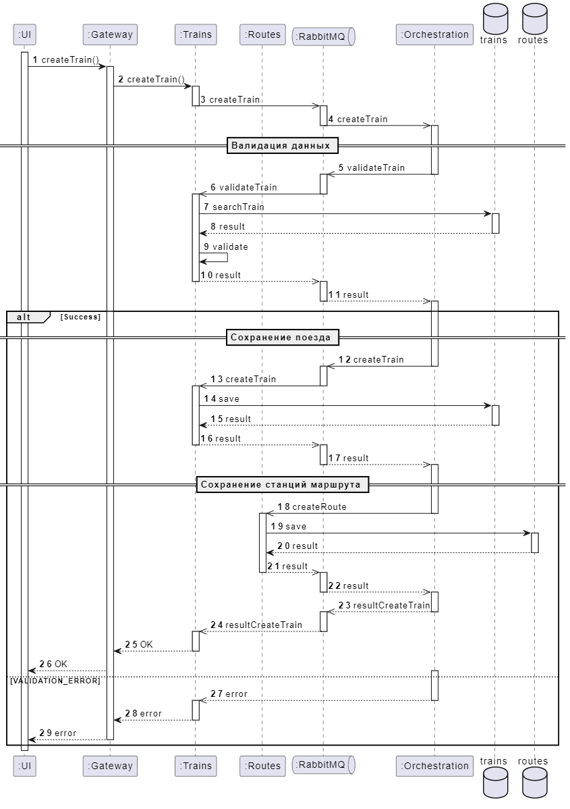

# Постановка задачи на back

## Создать поезд

**Наименование:** Разработка метода REST API создания нового поезда в графике движения поездов
**Описание:** Метод предназначен для создания новой пустой нитки (поезда) в графике движения поездов для последующего формирования расписания (маршрута) и наполнения поезда группами вагонов. Метод будет вызваться форонтендом при формировании ниток сотрудниками центрального аппарат ФПК.

### Требования к методу

<table>
    <tr>
        <th align="left">Метод</th>
        <td style="color: #078119" ><b>POST</td>
    </tr>
    <tr>
        <th align="left">Еndpoint</th>
        <td>/v1/trains</td>
    </tr>
</table>

#### Request

##### Headers

| Системное имя | Наименование                    | Источник                    |
| ------------- | ------------------------------- | --------------------------- |
| accept        | MIME-тип ожидаемого контента    | Значение "application/json" |
| Content-Type  | MIME-тип отправляемого контента | Значение "application/json" |
| Authorization | Авторизация                     | Bearer {token}              |

##### Body

| №    | Системное имя | Наименование                              | Тип     | О/Н | Ограничение                     |
| ---- | ------------- | ----------------------------------------- | ------- | --- | ------------------------------- |
| 1    | direct        | Прямой поезд                              | object  | О   |                                 |
| 1.1  | gdpId         | Идентификатор графика движения поездов    | integer | О   | > 0                             |
| 1.2  | carrierId     | Идентификатор перевозчика                 | integer | О   | > 0                             |
| 1.3  | number        | Номер поезда                              | string  | О   | от 2 до 5 символов              |
| 1.4  | fromStationId | Идентификатор станции отправления         | integer | О   | > 0                             |
| 1.5  | toStationId   | Идентификатор станции назначения          | integer | О   | > 0                             |
| 1.6  | departureAt   | Время отправления со станции формирования | string  | O   | Дата и время в формате iso 8601 |
| 1.7  | arrivalAt     | Время прибытия на станцию назначения      | string  | O   | Дата и время в формате iso 8601 |
| 1.8  | name          | Индивидуальное наименование поезда        | string  | Н   | <= 255 символов                 |
| 1.9  | isBrand       | Признак фирменного поезда                 | boolean | О   |                                 |
| 1.10 | seasonId      | Идентификатор сезонности                  | integer | О   |                                 |
| 2    | reverse       | Обратный поезд                            | object  | Н   | Структура аналогична п.1        |

<details>
    <summary>Пример тела запроса</summary>

```json
{
  "direct": {
    "gdpId": 1,
    "carrierId": 1,
    "number": "1А",
    "fromStationId": 1,
    "toStationId": 2,
    "departureAt": "2024-02-12T20:00:00Z",
    "arrivalAt": "2024-02-13T05:00:00Z",
    "name": "Невский экспресс",
    "isBrand": true,
    "seasonId": 1
  },
  "reverse": {
    "gdpId": 1,
    "carrierId": 1,
    "number": "2А",
    "fromStationId": 2,
    "toStationId": 1,
    "departureAt": "2024-02-13T12:00:00Z",
    "arrivalAt": "2024-02-13T21:00:00Z",
    "name": "Невский экспресс",
    "isBrand": true,
    "seasonId": 1
  }
}
```

</details>

#### Response

##### Status 201 Created

##### Headers

| Системное имя | Наименование                    | Источник                    |
| ------------- | ------------------------------- | --------------------------- |
| Content-Type  | MIME-тип отправляемого контента | Значение "application/json" |

##### Body

| №    | Системное имя | Тип     | Наименование                              | Примечание               |
| ---- | ------------- | ------- | ----------------------------------------- | ------------------------ |
| 1    | direct        | object  | Прямой поезд                              |                          |
| 1.1  | id            | integer | Идентификатор поезда                      |                          |
| 1.2  | gdpId         | integer | Идентификатор графика движения поездов    |                          |
| 1.3  | carrierId     | integer | Идентификатор перевозчика                 |                          |
| 1.4  | number        | string  | Номер поезда                              |                          |
| 1.5  | fromStationId | integer | Идентификатор станции отправления         |                          |
| 1.6  | toStationId   | integer | Идентификатор станции назначения          |                          |
| 1.7  | departureAt   | string  | Время отправления со станции формирования | Формат iso 8601          |
| 1.8  | arrivalAt     | string  | Время прибытия на станцию назначения      | Формат iso 8601          |
| 1.9  | name          | string  | Индивидуальное наименование поезда        |                          |
| 1.10 | isBrand       | boolean | Признак фирменного поезда                 |                          |
| 1.11 | seasonId      | integer | Идентификатор сезонности                  |                          |
| 1.12 | status        | string  | Статус поезда                             |                          |
| 1.13 | trainId       | integer | Идентификатор парного поезда              |                          |
| 2    | reverse       | object  | Обратный поезд                            | Структура аналогична п.1 |


<details>
    <summary>Пример ответа 201 Created</summary>

```json
{
  "direct": {
    "id": 1,
    "gdpId": 1,
    "carrierId": 1,
    "number": "1А",
    "categoryId": 1,
    "fromStationId": 1,
    "toStationId": 2,
    "departureAt": "2024-02-12T20:00:00Z",
    "arrivalAt": "2024-02-13T05:00:00Z",
    "name": "Невский экспресс",
    "isBrand": true,
    "seasonId": 1,
    "status": "planning",
    "trainId": 2
  },
  "reverse": {
    "id": 2,
    "gdpId": 1,
    "carrierId": 1,
    "number": "2А",
    "categoryId": 1,
    "fromStationId": 2,
    "toStationId": 1,
    "departureAt": "2024-02-13T12:00:00Z",
    "arrivalAt": "2024-02-13T21:00:00Z",
    "name": "Невский экспресс",
    "isBrand": true,
    "seasonId": 1,
    "status": "planning",
    "trainId": 1
  }
}
```

</details>

##### Status 4XX

##### Headers

| Системное имя | Наименование                    | Источник                    |
| ------------- | ------------------------------- | --------------------------- |
| Content-Type  | MIME-тип отправляемого контента | Значение "application/json" |

##### Body

| №     | Системное имя | Тип              | Наименование                                 |
| ----- | ------------- | ---------------- | -------------------------------------------- |
| 1     | error         | object           | Сведения об ошибке                           |
| 1.1   | code          | string           | Код ошибки                                   |
| 1.2   | message       | string           | Описание ошибки                              |
| 1.3   | details       | array of objects | Дополнительные сведения                      |
| 1.3.1 | field         | string           | Наименование поля, в котором возникла ошибка |
| 1.3.2 | message       | string           | Текст ошибки                                 |


<details>
    <summary>Пример ответа 400 Baq Request</summary>

```json
{
  "error": {
    "code": "VALIDATION_ERROR",
    "message": "Неверные параметры запроса",
    "details": [
      {
        "field": "number",
        "message": "В номере поезда должны быть указаны цифры и одна буква"
      }
    ]
  }
}
```

</details>

<details>
    <summary>Пример ответа 401 Unauthorized</summary>

```json
{
  "error": {
    "code": "UNAUTHORIZED",
    "message": "Сессия истекла",
    "details": [
      {
        "field": "Authorization",
        "message": "Истекло время действия токена доступа"
      }
    ]
  }
}
```

</details>

<details>
    <summary>Пример ответа 409 Conflict</summary>

```json
{
  "error": {
    "code": "DATA_CONFLICT",
    "message": "Конфликт данных",
    "details": [
      {
        "field": "direct.number",
        "message": "Поезд с номером 18А уже присутствует в ГДП"
      }
    ]
  }
}
```
</details>


##### Status 500 Internal Server Error

##### Headers

| Системное имя | Наименование                    | Источник                    |
| ------------- | ------------------------------- | --------------------------- |
| Content-Type  | MIME-тип отправляемого контента | Значение "application/json" |

##### Body

| №     | Системное имя | Тип              | Наименование                                 |
| ----- | ------------- | ---------------- | -------------------------------------------- |
| 1     | error         | object           | Сведения об ошибке                           |
| 1.1   | code          | string           | Код ошибки                                   |
| 1.2   | message       | string           | Описание ошибки                              |
| 1.3   | details       | array of objects | Дополнительные сведения                      |
| 1.3.1 | field         | string           | Наименование поля, в котором возникла ошибка |
| 1.3.2 | message       | string           | Текст ошибки                                 |


<details>
    <summary>Пример тела ответа</summary>

```json
{
  "error": {
    "code": "SERVER_ERROR",
    "message": "Внутренняя ошибка сервера",
    "details": [
      {
        "field": null,
        "message": "База данных не доступна"
      }
    ]
  }
}
```

</details>

### Бизнес-логика

#### Валидация

##### VALIDATION_ERROR

Проверки:

| №   | Поле           | Проверка                                                                                          | message                                                  |
| --- | -------------- | ------------------------------------------------------------------------------------------------- | -------------------------------------------------------- |
| 1   | \*.number      | Переводим строку в верхний регистр.<br>Значение должно соответствует формату: ^(0?\d{1,3}\[А-Я])$ | Номер поезда должен содержать 1-4 цифры и одну букву А-Я |
| 2   | \*.departureAt | \*.departureAt > current timestamp                                                                | Дата меньше текущей                                      |
| 3   | \*.arrivalAt   | \*.arrivalAt <= \*.departureAt                                                                    | Дата прибытия должна быть больше даты отправления        |

Если выявлены ошибки ФЛК вернуть ответ `statusCode = 400`. Для каждой ошибки добавить элемент массива `details`

| №     | Системное имя | Заполнение                                                                   |
| ----- | ------------- | ---------------------------------------------------------------------------- |
| 1     | error         |                                                                              |
| 1.1   | code          | `VALIDATION_ERROR`                                                           |
| 1.2   | message       | `Неверные параметры запроса`                                                 |
| 1.3   | details       |                                                                              |
| 1.3.1 | field         | Полное имя поля с использованием точечной нотации. Например: `direct.number` |
| 1.3.2 | message       | Представлено выше ↑                                                          |

Если ошибок нет переходим к следующему блоку проверок

##### DATA_CONFLICT

Проверки:

| №   | Поле                    | Проверка                                                                                  | message                                                        |
| --- | ----------------------- | ----------------------------------------------------------------------------------------- | -------------------------------------------------------------- |
| 1   | `reverse.number`        | `direct.number = reverse.number`                                                          | Номер поезда не должен совпадать с номером прямого поезда      |
| 2   | `*.number`              | Проверяем наличие поезда в таблице `trains` по номеру условию: `trains.number = *.number` | Поезд с номером `*.number` уже присутствует в ГДП              |
| 3   | `reverse.fromStationId` | `direct.fromStationId <> reverse.toStationId`                                             | Станция должна совпадать со станцией назначения прямого поезда |

Если выявлены ошибки ФЛК вернуть ответ `statusCode = 409`. Для каждой ошибки добавить элемент массива `details`

| №     | Системное имя | Заполнение                                                                   |
| ----- | ------------- | ---------------------------------------------------------------------------- |
| 1     | error         |                                                                              |
| 1.1   | code          | `DATA_CONFLICT`                                                              |
| 1.2   | message       | `Конфликт данных`                                                            |
| 1.3   | details       |                                                                              |
| 1.3.1 | field         | Полное имя поля с использованием точечной нотации. Например: `direct.number` |
| 1.3.2 | message       | Представлено выше ↑                                                          |


#### Сохранение поезда

1. Определяем категорию поезда.

В `requestBody.*.number` отбрасываем один символ справа и читаем таблицу `categories` по условию:

- `requestBody.*.number BETWEEN lower_bound AND upper_bound`

Определяем значение:

-  `id` 

2. Формируем в таблице `trains` две записи для прямого `direct` и обратного `reverse` поезда.

| №   | Системное имя | Заполнение                |
| --- | ------------- | ------------------------- |
| 1   | gdp_id        | `requestBody.*.gdpId`     |
| 2   | carrier_id    | `requestBody.*.carrierId` |
| 3   | number        | `requestBody.*.number`    |
| 4   | category_id   | `categories.id`           |
| 5   | name          | `requestBody.*.name`      |
| 6   | is_brand      | `requestBody.*.isBrand`   |
| 7   | season_id     | `requestBody.*.seasonId`  |
| 8   | status        | `planning`                |
| 9   | train_id      | `null`                    |

Определяем значение:

-  `id` 

3. Обновляем ссылки на обратный `reverse` прямой `direct` поезда.

| №   | Системное имя | Заполнение                |
| --- | ------------- | ------------------------- |
| 1   | train_id      | `trains.id`               |

#### Сохранение станций маршрута

Формируем в таблице `route` две записи для прямого `direct` и две записи для обратного `reverse` поезда.

1. Станция отправления

| №   | Системное имя | Заполнение                        |
| --- | ------------- | --------------------------------- |
| 1   | train_id      | `trains.id`                       |
| 2   | station_id    | `requestBody.*.fromStationId`     |
| 3   | arrival_at    | `null`                            |
| 4   | arrival_day   | `null`                            |
| 5   | departure_at  | `time(requestBody.*.departureAt)` |
| 6   | departure_day | `0`                               |
| 7   | distance      | `0`                               |

2. Станция назначения

| №   | Системное имя | Заполнение                                                        |
| --- | ------------- | ----------------------------------------------------------------- |
| 1   | train_id      | `trains.id`                                                       |
| 2   | station_id    | `requestBody.*.toStationId`                                       |
| 3   | arrival_at    | `time(requestBody.*.arrivalAt)`                                   |
| 4   | arrival_day   | `date(requestBody.*.arrivalAt) - date(requestBody.*.departureAt)` |
| 5   | departure_at  | `null`                                                            |
| 6   | departure_day | `null`                                                            |
| 7   | distance      | `0`                                                               |

#### Формирование ответа

Если ошибок нет и записи сформированы `statusCode = 201`.

| №    | Системное имя | Заполнение                                                                  |
| ---- | ------------- | --------------------------------------------------------------------------- |
| 1    | direct        |                                                                             |
| 1.1  | id            | `trains.id`                                                                 |
| 1.2  | gdpId         | `trains.gdp_id`                                                             |
| 1.3  | carrierId     | `trains.carrier_id`                                                         |
| 1.4  | categoryId    | `trains.category_id`                                                        |
| 1.5  | fromStationId | `route.station_id` - первая запись маршрута                                 |
| 1.5  | toStationId   | `route.station_id` - последняя запись маршрута                              |
| 1.6  | departureAt   | `schemes.departure_at[0]` +  `route.departure_at` - первая запись маршрута  |
| 1.7  | arrivalAt     | `schemes.departure_at[0]` +  `route.arrival_at` - последняя запись маршрута |
| 1.8  | name          | `trains.name`                                                               |
| 1.9  | isBrand       | `trains.is_brand`                                                           |
| 1.10 | seasonId      | `trains.season_id`                                                          |
| 1.11 | status        | `trains.status`                                                             |
| 1.12 | trainId       | `trains.train_id`                                                           |
| 2    | reverse       | По аналогии с п.1                                                           |

### Схема прохождения запроса

#### UML Sequence diagram


