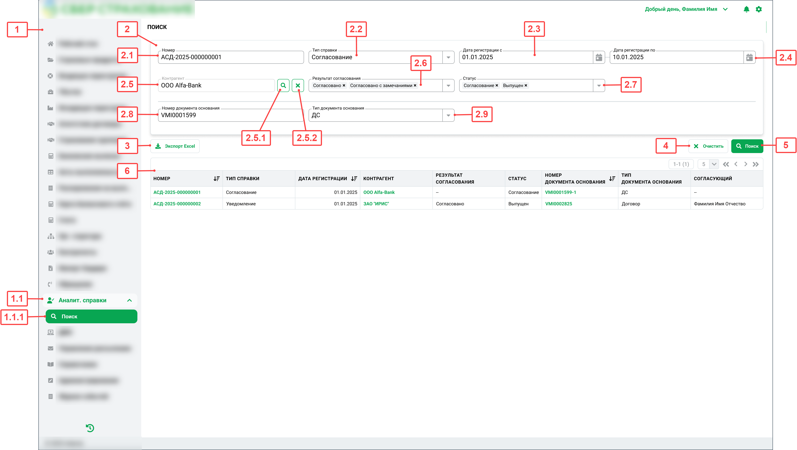

# Постановка задачи на front

**Легенда:**

При выпуске документов (договор, дополнительное соглашение и др.) выполняется проверка на соответствие контрагента 115-ФЗ. В рамках процесса проверки создается документ (аналитическая справка) для подразделения комплаенс, в котором содержаться сведения о контрагенте и договорах заключенных ранее и черных списках, в которые внесен контрагент. Сотрудник подразделения комплаенс выполняет рассмотрение контрагента и принимает решение о согласовании и отказе в выпуске основного документа.

## Журнал аналитических справочных документов

<table>
    <tr>
        <th>Наименование</th>
        <td>Реестр АСД</td>
    </tr>
    <tr>
        <th>Расположение</th>
        <td>Меню → Аналитические справки → Поиск</td>
    </tr> 
</table>

### Цель

Просмотр реестра аналитических справочных документа

### Задачи

- Доступ к реестру документов;
- Поиск и фильтрация документов;
- Экспорт результатов поиска в файл.

### Макет

#### Фигма

[figma](https://www.figma.com/example)

#### Описание

##### Реестр АСД

###### Экран

​​

<p align="center">Рисунок 1. Реестр аналитических справочных документов</p>

###### Компоненты

| №     | Наименование                                    | Тип         | Источник данных                                                                             | Логика работы                                                                                                                                                                                                          | Полномочия       |
| ----- | ----------------------------------------------- | ----------- | ------------------------------------------------------------------------------------------- | ---------------------------------------------------------------------------------------------------------------------------------------------------------------------------------------------------------------------- | ---------------- |
| 1     | Левое боковое меню                              | sideBar     | -                                                                                           | -                                                                                                                                                                                                                      | -                |
| 1.1   | Аналитические справочные документы              | menuItem    | -                                                                                           | При нажатии выполняется переход в состояние `active`                                                                                                                                                                   | view.searchARD   |
| 1.1.1 | Реестр АСД                                      | menuItem    | -                                                                                           | При принажатии:<br>- выполняется переход в состояние `active`;<br>- выполняется запрос на поиск документов с фильтрами по умолчанию                                                                                    | view.searchARD   |
| 2     | Блок с фильтрами                                | card        | -                                                                                           | -                                                                                                                                                                                                                      | -                |
| 2.1   | Номер АСД                                       | input       | -                                                                                           | -                                                                                                                                                                                                                      | -                |
| 2.2   | Тип справки                                     | select      | GET {{base_url}}/api/v1/reportsTypes/search<br>Response body:<br> - $.items[*].name         | По умолчанию не заполнено                                                                                                                                                                                              | -                |
| 2.3   | Дата начала периода выборки по дате регистрации | datePicker  | -                                                                                           | По умолчанию не заполнено.<br>Для выбора доступны даты не больше, чем текущая дата;<br>Для выбора не доступны даты больше, чем 2.4" Дата окончания периода"                                                            | -                |
| 2.4   | Дата окончания выборки по дате регистрации      | datePicker  | -                                                                                           | По умолчанию не заполнено.<br>Для выбора доступны даты не больше, чем текущая дата;<br>Для выбора не доступны даты меньше, чем 2.3" Дата начала периода"                                                               | -                |
| 2.5   | Контрагент                                      | select      | GET {{base_url}}/api/v1/parties/{id}<br>Response body:<br>- $.fullName                      | По умолчанию не заполнено.<br>Не доступно для ввода данных с клавиатуры. Заполняется только путем выбора в модальном окне (см. 2.5.1)                                                                                  | -                |
| 2.5.1 | Поиск                                           | button      | -                                                                                           | Используется типовой компонент. При нажатии отображается модальное окно выбора контрагента (описание см. в ["МОк Выбор контрагента"](https://empty/link))                                                              | -                |
| 2.5.2 | Очистить                                        | button      | -                                                                                           | При нажатии выполняется очистка поля 2.5 "Контрагент"                                                                                                                                                                  | -                |
| 2.6   | Результат согласования                          | multiSelect | GET {{base_url}}/api/v1/complienceDesision/search<br>Response body:<br> - $.items[\*\].name | По умолчанию не заполнено                                                                                                                                                                                              | -                |
| 2.7   | Статус АСД                                      | multiSelect | GET {{base_url}}/api/v1/state/search?entity=ard<br>Response body:<br>- $.items[\*\].name    | По умолчанию не заполнено                                                                                                                                                                                              | -                |
| 2.8   | Номер документа основания                       | input       | -                                                                                           | По умолчанию не заполнено                                                                                                                                                                                              | -                |
| 2.9   | Тип документа основания                         | select      | GET {{base_url}}/api/v1/documentsTypes/search<br>Response body:<br> - $.items\[\*].name     | По умолчанию не заполнено                                                                                                                                                                                              | -                |
| 3     | Экспорт в файл                                  | button      | -                                                                                           | При нажатии выполняется вызов метода формирования файла выгрузки реестра (см. описание функции ["Экспорт в файл](#экспорт-в-файл))                                                                                     | export.searchARD |
| 4     | Очистить                                        | button      | -                                                                                           | При нажатии выполняется очистка значений полей в блоке с фильтрами (2)                                                                                                                                                 | -                |
| 5     | Поиск                                           | button      | -                                                                                           | При нажатии выполняется вызов метода получения списка АСД (см. описание функции ["Получить список АСД"](#получить-список-асд))                                                                                         | view.searchARD   |
| 6     | Таблица результатов                             | table       | POST {{base_url}}/api/v1/analiticalReferenceDocuments/search                                | -                                                                                                                                                                                                                      | -                |
| 6.1   | Шапка                                           | tableHeader | -                                                                                           | Сортировка строк выполняется только по однму из столбцов, по которым допускается сортировка. По умолчанию сортировка по столбцу (6.1.1) "Номер"                                                                        | -                |
| 6.1.1 | Номер                                           | text        | -                                                                                           | По умолчанию выполняется прямая сортировка.<br>При нажатии направление сортировки меняется на обратное                                                                                                                 | -                |
| 6.1.2 | Тип справки                                     | text        | -                                                                                           | -                                                                                                                                                                                                                      | -                |
| 6.1.3 | Дата регистрации                                | text        | -                                                                                           | Возможность сортировки по столбцу. При первом нажатии прямая сортировка. При последующих нажатия сортировка меняется на обратную                                                                                       | -                |
| 6.1.4 | Контрагент                                      | text        | -                                                                                           | -                                                                                                                                                                                                                      | -                |
| 6.1.5 | Результат согласования                          | text        | -                                                                                           | -                                                                                                                                                                                                                      | -                |
| 6.1.6 | Статус                                          | text        | -                                                                                           | -                                                                                                                                                                                                                      | -                |
| 6.1.7 | Номер документа основания                       | text        | -                                                                                           | Возможность сортировки по столбцу. При первом нажатии прямая сортировка. При последующих нажатия сортировка меняется на обратную                                                                                       | -                |
| 6.1.8 | Тип документа основания                         | text        | -                                                                                           | -                                                                                                                                                                                                                      | -                |
| 6.1.9 | Согласующий                                     | text        | -                                                                                           | -                                                                                                                                                                                                                      | -                |
| 6.2   | Строка                                          | tableRow    | -                                                                                           | -                                                                                                                                                                                                                      | -                |
| 6.2.1 | Номер                                           | link        | Response body:<br> - \$.items[\*].ard.id<br> - \$.items[\*].ard.number                      | Формируется из Response:<br>\<a href=\"{{base_url}}/analiticalReferenceDocuments/\{id}"\>\{number}\</a>                                                                                                                | -                |
| 6.2.2 | Тип справки                                     | text        | Response body:<br> - \$.items[\*].ard.type                                                  | -                                                                                                                                                                                                                      | -                |
| 6.2.3 | Дата регистрации                                | text        | Response body:<br> - \$.items[\*].ard.registrationDate                                      | -                                                                                                                                                                                                                      | -                |
| 6.2.4 | Контрагент                                      | link        | Response body:<br> - \$.items\[*].party.id<br> - \$.items[\*].party.shortName               | Формируется из Response:<br>\<a href=\"{{base_url}}/parties/\{id}"\>\{shortName}\</a>                                                                                                                                  | -                |
| 6.2.5 | Результат согласования                          | text        | Response body:<br> - \$.items[\*].ard.approvalSummary                                       | -                                                                                                                                                                                                                      | -                |
| 6.2.6 | Статус                                          | text        | Response body:<br> - \$.items[\*].ard.state                                                 | -                                                                                                                                                                                                                      | -                |
| 6.2.7 | Номер документа основания                       | link        | Response body:<br> - \$.items[\*].basisDocument.id<br> - \$.items[\*].basisDocument.number  | Формируется из Response:<br>- Если `type IN ("Contract", "Amedment")`тогда:<br>\<a href=\"{{base_url}}/policies/\{id}"\>\{number}\</a><br> - Иначе:<br>\<a href=\"{{base_url}}/paymentDocuments/\{id}"\>\{number}\</a> | -                |
| 6.2.8 | Тип документа основания                         | text        | Response body:<br> - \$.items[\*].basisDocument.type                                        | -                                                                                                                                                                                                                      | -                |
| 6.2.9 | Согласующий                                     | text        | Response body:<br> - \$.items[\*].ard.сoordinator                                           | -                                                                                                                                                                                                                      | -                |
| 6.3   | Пагинация                                       | pagination  | -                                                                                           | -                                                                                                                                                                                                                      | -                |
| 6.3.1 | Номер первой строки                             | text        | Response body:<br> - \$.offset                                                              | Формируется из Response:<br>1 + {offset}                                                                                                                                                                               |                  |
| 6.3.2 | Номер последней строки                          | text        | Response body:<br> - \$.offset<br> - \$.count                                               | Формируется из Response:<br>1 + {offset} +{count}                                                                                                                                                                      |                  |
| 6.3.3 | Общее количество строк                          | text        | Response body:<br> - \$.totalCount                                                          | Формируется из Response:<br>{totalCount}                                                                                                                                                                               |                  |
| 6.3.4 | Количество строк на странице                    | select      | Выпадающий список:<br>- 5;<br>- 10;<br>- 15;<br>- 20.                                       | По умолчанию значение "5"                                                                                                                                                                                              | -                |
###### Поля ввода

| №   | Наименование              | О/Н | Ограничение                                              | ФЛК | Текст подсказки |
| --- | ------------------------- | --- | -------------------------------------------------------- | --- | --------------- |
| 2.1 | Номер                     | Н   | Не более 255 знаков                                      | -   | -               |
| 2.2 | Тип справки               | Н   | Значение из списка                                       | -   | -               |
| 2.3 | Дата регистрации с        | Н   | Не более текущей и не более  (2.4) "Дата регистрации по" | -   | -               |
| 2.4 | Дата регистрации по       | Н   | Не более текущей и не менее  (2.3) "Дата регистрации с"  | -   | -               |
| 2.5 | Контрагент                | Н   | Значение из списка                                       | -   | -               |
| 2.6 | Результат согласования    | Н   | Значение из списка                                       | -   | -               |
| 2.7 | Статус                    | Н   | Значение из списка                                       | -   | -               |
| 2.8 | Номер документа основания | Н   | Не более 255 знаков                                      | -   | -               |
| 2.9 | Тип документа основания   | Н   | Значение из списка                                       | -   | -               |

### Функции

#### Получить список АСД

<table>
    <tr>
        <th>Метод</th>
        <td>POST</td>
    </tr>
    <tr>
        <th>Endpoint</th>
        <td>{{base_url}}/api/v1/analiticalReferenceDocuments/search</td>
    </tr>
    <tr>
        <th>Документация</th>
        <td><a href="www.empty.com">API Spec</a></td>
    </tr>
</table>

##### Request

###### headers

| №   | Системное имя | Наименование                    | Значение         |
| --- | ------------- | ------------------------------- | ---------------- |
| 1   | Accept        | MIME-тип ожидаемого контента    | application/json |
| 2   | Content-Type  | MIME-тип отправляемого контента | application/json |
###### body

| №     | Системное имя    | Тип              | Наименование                                         | Источник                               |
| ----- | ---------------- | ---------------- | ---------------------------------------------------- | -------------------------------------- |
| 1     | offset           | integer          | Смещение (количество пропускаемых записей от начала) | (6.3.1) Количество записей на странице |
| 2     | limit            | integer          | Количество записей на странице                       | (6.3.4) Количество строк на странице   |
| 3     | filters          | object           | Фильтры                                              | (2) Блок с фильтрами                   |
| 3.1   | ard              | object           | АСД                                                  | -                                      |
| 3.1.1 | number           | string           | Номер АСД                                            | (2.1) Номер                            |
| 3.1.2 | type             | string           | Тип справки                                          | (2.2) Тип справки                      |
| 3.1.3 | registrationFrom | string/date      | Начало периода выборки по дате регистрации           | (2.3) Дата регистрации с               |
| 3.1.4 | registrationTo   | string/date      | Окончание периода выборки по дате регистрации          | (2.4) Дата регистрации по              |
| 3.1.5 | party            | uuid             | Идентификатор контрагента                            | (2.5) Контрагент                       |
| 3.1.6 | approvalSummary  | array of strings | Результат согласования                               | (2.6) Результат согласования           |
| 3.1.7 | state            | array of strings | Статус АСД                                           | (2.7) Статус                           |
| 3.2   | basisDocument    | object           | Номер документа основания                            | -                                      |
| 3.2.1 | number           | string           | Номер документа основания                            | (2.8) Номер документа основания        |
| 3.2.2 | type             | string           | Тип документа основания                              | (2.9) Тип документа основания          |

<details>
    <summary>Пример Body</summary>

```json
{
  "offset": 0,
  "limit": 10,
  "filters": {
    "ard": {
      "number": "АСД-2025-00000001",
      "type": "Approve",
      "registrationFrom": "2025-01-01",
      "registrationTo": "2025-01-10",
      "party": "123e4567-e89b-12d3-a456-426614174000",
      "approvalSummary": ["Approved", "ApprovedWithRevisions"],
      "state": ["Approval", "Active"]
    },
    "basisDocument": {
      "number": "VMI000001",
      "type": "Amedment"
    }
  }
}

```
</details>

##### Response
###### headers

| №   | Системное имя | Наименование                    | Значение         |
| --- | ------------- | ------------------------------- | ---------------- |
| 1   | Content-Type  | MIME-тип отправляемого контента | application/json |
###### body

| №     | Системное имя    | Тип              | О/Н | Наименование                                         |
| ----- | ---------------- | ---------------- | --- | ---------------------------------------------------- |
| 1     | totalCount       | integer          | О   | Общее количество элементов                           |
| 2     | count            | integer          | О   | Количество количество элементов на странице          |
| 3     | offset           | integer          | О   | Смещение (количество пропускаемых записей от начала) |
| 4     | items            | array of objects | О   | Список элементов                                     |
| 4.1   | ard              | object           | Н   | АСД                                                  |
| 4.1.1 | id               | uuid             | O   | Идентификатор АСД                                    |
| 4.1.2 | number           | string           | О   | Номер                                                |
| 4.1.3 | type             | string           | О   | Тип                                                  |
| 4.1.4 | registrationDate | string/date      | О   | Дата регистрации                                     |
| 4.1.5 | approvalSummary  | string           | Н   | Результат согласования                               |
| 4.1.6 | state            | string           | О   | Статус                                               |
| 4.1.7 | сoordinator      | string           | Н   | Согласующий                                          |
| 4.2   | party            | object           | О   | Контрагент                                           |
| 4.2.1 | id               | uuid             | О   | Идентификатор контрагента                            |
| 4.2.2 | shortName        | string           | О   | Сокращенное наименование контрагента                 |
| 4.3   | basisDocument    | object           | О   | Документ основание                                   |
| 4.3.1 | id               | uuid             | О   | Идентификатор документа основания                    |
| 4.3.1 | number           | string           | О   | Номер                                                |
| 4.3.2 | type             | string           | О   | Тип                                                  |
<details>
    <summary>Пример Body</summary>

```json
{
  "totalCount": 122,
  "count": 2,
  "offset": 120,
  "items": [
    {
      "ard": {
        "id": "02c8c3e3-e8e0-43af-bb31-a8749e4b3a7e",
        "number": "АСД-2025-00000001",
        "type": "Approve",
        "registrationDate": "2025-01-01",
        "approvalSummary": null,
        "state": "Approval",
        "сoordinator": null
      },
      "party": {
        "id": "123e4567-e89b-12d3-a456-426614174000",
        "shortName": "ООО Alfa-Bank"
      },
      "basisDocument": {
        "id": "9ff4dabe-92bd-4d56-af6d-6e7a5027bddd",
        "number": "VMI000001599-1",
        "type": "Amedment"
      }
    },
    {
      "ard": {
        "id": "4d3ed0f2-bcc6-4f66-8946-957af2726a38",
        "number": "АСД-2025-00000002",
        "type": "Approve",
        "registrationDate": "2025-01-01",
        "approvalSummary": "Approved",
        "state": "Active",
        "сoordinator": "Фамилия Имя Отчество"
      },
      "party": {
        "id": "123e4567-e89b-12d3-a456-426614174000",
        "fullName": "ЗАО \"ИРИС\""
      },
      "basisDocument": {
        "id": "02c8c3e3-e8e0-43af-bb31-a8749e4b3a7e",
        "number": "VMI000002825",
        "type": "Contract"
      }
    }
  ]
}
```
</details>

#### Экспорт в файл

<table>
    <tr>
        <th>Метод</th>
        <td>POST</td>
    </tr>
    <tr>
        <th>Endpoint</th>
        <td>{{base_url}}/api/v1/analiticalReferenceDocuments/search/export</td>
    </tr>
    <tr>
        <th>Документация</th>
        <td><a href="www.empty.com">API Spec</a></td>
    </tr>
</table>

##### Request

###### headers

| №   | Системное имя | Наименование                    | Значение                                                          |
| --- | ------------- | ------------------------------- | ----------------------------------------------------------------- |
| 1   | Accept        | MIME-тип ожидаемого контента    | application/vnd.openxmlformats-officedocument.spreadsheetml.sheet |
| 2   | Content-Type  | MIME-тип отправляемого контента | application/json                                                  |
###### body

| №   | Системное имя    | Тип              | Наименование                                  | Источник                        |
| --- | ---------------- | ---------------- | --------------------------------------------- | ------------------------------- |
| 1   | ard              | object           | АСД                                           | -                               |
| 1.1 | number           | string           | Номер АСД                                     | (2.1) Номер                     |
| 1.2 | type             | string           | Тип справки                                   | (2.2) Тип справки               |
| 1.3 | registrationFrom | string/date      | Начало периода выборки по дате регистрации    | (2.3) Дата регистрации с        |
| 1.4 | registrationTo   | string/date      | Окончание периода выборки по дате регистрации | (2.4) Дата регистрации по       |
| 1.5 | party            | uuid             | Идентификатор контрагента                     | (2.5) Контрагент                |
| 1.6 | approvalSummary  | array of strings | Результат согласования                        | (2.6) Результат согласования    |
| 1.7 | state            | array of strings | Статус АСД                                    | (2.7) Статус                    |
| 2   | basisDocument    | object           | Номер документа основания                     | -                               |
| 2.1 | number           | string           | Номер документа основания                     | (2.8) Номер документа основания |
| 2.2 | type             | string           | Тип документа основания                       | (2.9) Тип документа основания   |

<details>
    <summary>Пример Body</summary>

```json
{
  "ard": {
    "number": "АСД-2025-00000001",
    "type": "Approve",
    "registrationFrom": "2025-01-01",
    "registrationTo": "2025-01-10",
    "party": "123e4567-e89b-12d3-a456-426614174000",
    "approvalSummary": [
      "Approved",
      "ApprovedWithRevisions"
    ],
    "state": [
      "Approval",
      "Active"
    ]
  },
  "basisDocument": {
    "number": "VMI000001",
    "type": "Amedment"
  }
}
```
</details>

##### Response
###### headers

| №   | Системное имя       | Наименование                    | Значение                                                          |
| --- | ------------------- | ------------------------------- | ----------------------------------------------------------------- |
| 1   | Content-Type        | MIME-тип отправляемого контента | application/vnd.openxmlformats-officedocument.spreadsheetml.sheet |
| 2   | Content-Disposition | Способ обработки контента       | attachment; filename="ard_2025-12-12.xlsx"                        |
| 3   | Content-Length      | Размер файла                    |                                                                   |
###### body

<бинарные данные файла xlsx>