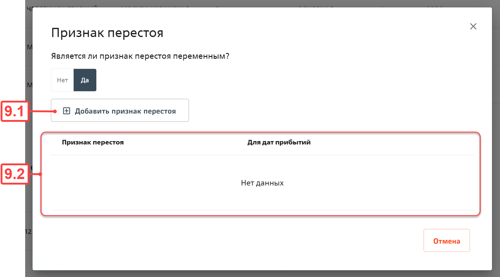

# Постановка задачи на front

## Карточка группы вагонов

<table>
    <tr>
        <th>Наименование</th>
        <td>Карточка группы вагонов</td>
    </tr>
    <tr>
        <th>Расположение</th>
        <td>Главная → Внесение схем → Перечень групп вагонов → Строка (группа вагонов)</td>
    </tr> 
</table>

### Общие сведения

Раздел предназначен для выполнения следующих функций:
- заголовок группы:
    - просмотреть;
    - перейти к редактированию;
- оборот группы:
    - добавить поезд;
    - редактировать;
    - удалить поезд;
    - признак перестоя:
        - просмотреть;
        - добавить;
        - редактировать;
        - удалить;
- периодичность:
    - просмотреть;
    - добавить период;
    - редактировать период;
    - удалить период;
- вагоны:
    - перейти к созданию;
    - перейти к редактированию;
    - удалить;
- экспортировать группу в схему.

### Макет

#### Фигма

[figma](https://www.figma.com/example)

#### Описание

##### Карточка группы вагонов

###### Экран

​​

Рисунок 1. Карточка группы вагонов

###### Компоненты

| №           | Наименование                                    | Тип         | Источник данных                                                                           | Подсказка                                    | Логика работы                                                                                                                                                                                                                                                                     | Права доступа                                                 |
| ----------- | ----------------------------------------------- | ----------- | ----------------------------------------------------------------------------------------- | -------------------------------------------- | --------------------------------------------------------------------------------------------------------------------------------------------------------------------------------------------------------------------------------------------------------------------------------- | ------------------------------------------------------------- |
| 1.1         | Хлебные крошки                                  | breadcrumb  | -                                                                                         | -                                            | -                                                                                                                                                                                                                                                                                 | -                                                             |
| 1.1.1       | Перечень групп вагонов                          | link        | -                                                                                         | -                                            | При нажатии выполняется переход на страницу {base_url}/wagon-groups/scheme/planning                                                                                                                                                                                               | -                                                             |
| 1.1.2       | Группа вагонов                                  | text        | -                                                                                         | -                                            | -                                                                                                                                                                                                                                                                                 | -                                                             |
| 1.2         | Статус группы вагонов                           | tag         | query.carriageGroups.carriageGroupById(id).step_status                                    | -                                            | -                                                                                                                                                                                                                                                                                 | carriageGroups.carriageGroupById                              |
| 1.3         | Сведения заголовка группы                       | -           | query.carriageGroups.carriageGroupById(id)                                                | -                                            | -                                                                                                                                                                                                                                                                                 | carriageGroups.carriageGroupById                              |
| 1.3.1       | Состав группы                                   | tag         | -                                                                                         | -                                            | -                                                                                                                                                                                                                                                                                 | -                                                             |
| 1.3.1.1     | Наименование типа вагонов для включения в схемы | text        | carriage_parameters.carriage.item.carriage_type.carriage_types_for_schema.name            | -                                            | -                                                                                                                                                                                                                                                                                 | -                                                             |
| 1.3.1.2     | Количество вагонов                              | text        | carriage_parameters.carriage.item.carriage_type.carriage_types_for_schema.name            | -                                            | Суммируется количество вагонов одного типа                                                                                                                                                                                                                                        | -                                                             |
| 1.3.2       | Действие                                        | button      | -                                                                                         | -                                            | Отображается только для групп в статусе «На редактировании»                                                                                                                                                                                                                       | -                                                             |
| 1.3.2.1     | Редактировать                                   | menuItem    | -                                                                                         | -                                            | При нажатии отображается модальное окно редактирования сведений заголовка группы (см. рис. 2)                                                                                                                                                                                     | carriageGroups.updateCarriageGroup                            |
| 1.3.3       | Название                                        | text        | name                                                                                      | -                                            | -                                                                                                                                                                                                                                                                                 | -                                                             |
| 1.3.4       | Администрация                                   | text        | railway_administration.short_name                                                         | -                                            | -                                                                                                                                                                                                                                                                                 | -                                                             |
| 1.3.5       | Перевозчик                                      | text        | passenger_carrier.short_name                                                              | -                                            | -                                                                                                                                                                                                                                                                                 | -                                                             |
| 1.3.6       | Филиал                                          | text        | branch\.name                                                                               | -                                            | -                                                                                                                                                                                                                                                                                 | -                                                             |
| 1.3.7       | Предприятие приписки                            | text        | structural_subdivision.short_name                                                         | -                                            | -                                                                                                                                                                                                                                                                                 | -                                                             |
| 1.3.8       | Тип подвижного состава                          | text        | rolling_stock_type                                                                        | -                                            | -                                                                                                                                                                                                                                                                                 | -                                                             |
| 1.3.9       | Количество составов                             | cell        | -                                                                                         | -                                            | -                                                                                                                                                                                                                                                                                 | -                                                             |
| 1.3.9.1     | Количество                                      | text        | train_quantities.quantity                                                                 | -                                            | -                                                                                                                                                                                                                                                                                 | -                                                             |
| 1.3.9.2     | Глаз                                            | button      | -                                                                                         | -                                            | При нажатии отображаются/скрываются сведения о количестве составов (1.4) и времени оборота (1.5). Иконка одновременно (1.3.9.2) и (1.3.10.2) меняется с eye на eyeInvisible.   По умолчанию отображается eye                                                                   | -                                                             |
| 1.3.10      | Время оборота                                   | cell        | -                                                                                         | -                                            | -                                                                                                                                                                                                                                                                                 | -                                                             |
| 1.3.10.1    | Время                                           | text        | turnaround_times.turn_around_time                                                         | -                                            | Формат отображения времени: «чч» + "ч " + «мм» + "м"   **Пример:** 38ч 10м                                                                                                                                                                                                     | -                                                             |
| 1.3.10.2    | Глаз                                            | button      | -                                                                                         | -                                            | При нажатии отображаются/скрываются сведения о количестве составов (1.4) и времени оборота (1.5). Иконка одновременно (1.3.9.2) и (1.3.10.2) меняется с eye на eyeInvisible.   По умолчанию отображается eye                                                                   | -                                                             |
| 1.4         | Количество составов                             | table       | -                                                                                         | -                                            | -                                                                                                                                                                                                                                                                                 | -                                                             |
| 1.4.1       | Шапка таблицы                                   | tableHeader | -                                                                                         | -                                            | -                                                                                                                                                                                                                                                                                 | -                                                             |
| 1.4.2       | Строка                                          | row         | train_quantities.order_number                                                             | -                                            | -                                                                                                                                                                                                                                                                                 | -                                                             |
| 1.4.2.1     | Количество                                      | text        | train_quantities.quantity                                                                 | -                                            | -                                                                                                                                                                                                                                                                                 | -                                                             |
| 1.4.2.2     | Периоды курсирования                            | text        | turnaround_times.departure_dates   turnaround_times.arrival_dates_with_time_stagnation | -                                            | Формат отображения даты: «ДД.ММ.ГГГГ»                                                                                                                                                                                                                                             | -                                                             |
| 1.5         | Время оборота                                   | table       | -                                                                                         | -                                            | -                                                                                                                                                                                                                                                                                 | -                                                             |
| 1.5.1       | Шапка таблицы                                   | tableHeader | -                                                                                         | -                                            | -                                                                                                                                                                                                                                                                                 | -                                                             |
| 1.5.2       | Строка                                          | row         | -                                                                                         | -                                            | -                                                                                                                                                                                                                                                                                 | -                                                             |
| 1.5.2.1     | Время оборота                                   | text        | turnaround_times.turn_around_time                                                         | -                                            | Минуты переводятся в часы   Формат отображения времени: «чч» + "ч " + «мм» + "м"   **Пример:** 38ч 10м                                                                                                                                                                      | -                                                             |
| 1.5.2.2     | Даты отправлений                                | button      | -                                                                                         | -                                            | При нажатии отображается МО с календарём с отправлениями группы (см. рис. 3)                                                                                                                                                                                                      | -                                                             |
| 1.5.2.3     | Даты прибытий                                   | button      | -                                                                                         | -                                            | При нажатии отображается МО с календарём с прибытиями группы (см. рис. 3)                                                                                                                                                                                                         | -                                                             |
| 1.6         | Оборот группы                                   | table       | -                                                                                         | -                                            | -                                                                                                                                                                                                                                                                                 | -                                                             |
| 1.6.1       | Шапка таблицы                                   | tableHeader | -                                                                                         | -                                            | -                                                                                                                                                                                                                                                                                 | -                                                             |
| 1.6.2       | Строка                                          | row         | -                                                                                         | -                                            | -                                                                                                                                                                                                                                                                                 | -                                                             |
| 1.6.2.1     | Признак начальной позиции продажи билетов       | checkbox    | turnovers.is_start_position_for_sale_direct_tickets                                       | Начальная позиция для продажи прямых билетов | -                                                                                                                                                                                                                                                                                 | -                                                             |
| 1.6.2.2     | Номер поезда                                    | link        | turnovers.train.train_number                                                              | -                                            | При нажатии выполняется переход на страницу   {base_url}/trains/scheme/planning/{train.id}/scheme                                                                                                                                                                              | -                                                             |
| 1.6.2.3     | Станция отправления                             | text        | turnovers.station_from.full_name                                                          | -                                            | -                                                                                                                                                                                                                                                                                 | -                                                             |
| 1.6.2.4     | Станция назначения                              | text        | turnovers.station_to.full_name                                                            | -                                            | -                                                                                                                                                                                                                                                                                 | -                                                             |
| 1.6.2.5     | Признак группы                                  | text        | turnovers.group_sign                                                                      | -                                            | -                                                                                                                                                                                                                                                                                 | -                                                             |
| 1.6.2.6     | Расположение                                    | text        | turnovers.position                                                                        | -                                            | -                                                                                                                                                                                                                                                                                 | -                                                             |
| 1.6.2.7     | Идентификаторы схем                             | text        | turnovers.schemas\.id                                                                      | -                                            | Идентификаторы схем перечисляются через запятую                                                                                                                                                                                                                                   | -                                                             |
| 1.6.2.8     | Мест всего/В продаже                            | text        | turnovers.seats_total   turnovers.seats_for_sale                                       | -                                            | Строка формируется в формате:   ${seats_total} + "/" + ${seats_for_sale}   **Пример:** 166/160                                                                                                                                                                              | -                                                             |
| 1.6.2.9     | Признак перестоя                                | text        | turnovers.turnover_time_stagnations                                                       | -                                            | -                                                                                                                                                                                                                                                                                 | -                                                             |
| 1.6.2.10    | Действие                                        | button      | -                                                                                         | -                                            | Отображается только для групп в статусе «На редактировании»                                                                                                                                                                                                                       | -                                                             |
| 1.6.2.10.1  | Просмотр признака перестоя                      | menuItem    | -                                                                                         | -                                            | При нажатии отображается МО просмотра перестоя:   - Если признак перестоя отсутствует. тогда отображается МО рис. 4   - Если введен постоянный признак перестоя, тогда отображается МО рис. 6   - Если введён переменный признак перестоя, тогда отображается МО рис. 11 | -                                                             |
| 1.6.2.10.2  | Редактировать                                   | menuItem    | -                                                                                         | -                                            | При нажатии отображается МО редактирования сведений маршрута и дополнительных сведений следования группы в поезде (см. рис. 15)                                                                                                                                                   | carriageGroups.updateTurnover                                 |
| 1.6.2.10.3  | Добавить запись выше                            | menuItem    | -                                                                                         | -                                            | При нажатии отображается МО добавления поезда в оборот группы (см. рис. 14)   Новая строка добавляется над выбранной                                                                                                                                                           | carriageGroups.addTurnover                                    |
| 1.6.2.10.4  | Добавить запись ниже                            | menuItem    | -                                                                                         | -                                            | При нажатии отображается МО добавления поезда в оборот группы (см. рис. 14)   Новая строка добавляется под выбранной                                                                                                                                                           | carriageGroups.addTurnover                                    |
| 1.6.2.10.5  | Удалить                                         | menuItem    | -                                                                                         | -                                            | При нажатии отображается модальное окно подтверждения удаления поезда из оборота (см. рис. 16)                                                                                                                                                                                    | carriageGroups.deleteTurnover                                 |
| 1.7         | Добавить поезд и маршрут в оборот группы        | button      | -                                                                                         | -                                            | Отображается только для групп в статусе «На редактировании».   При нажатии отображается МО добавления поезда в оборот группы (см. рис. 14)   Новая строка добавляется в конец списка                                                                                        | carriageGroups.addTurnover                                    |
| 1.8         | Календарь                                       | button      | -                                                                                         | -                                            | При нажатии отображается МО календарём с датами периодичности курсирования (см. рис. 17)                                                                                                                                                                                          | -                                                             |
| 1.9         | Периодичность отправления                       | table       | -                                                                                         | -                                            | -                                                                                                                                                                                                                                                                                 | -                                                             |
| 1.9.1       | Шапка таблицы                                   | tableHeader | -                                                                                         | -                                            | -                                                                                                                                                                                                                                                                                 | -                                                             |
| 1.9.2       | Строка                                          | row         | -                                                                                         | -                                            | -                                                                                                                                                                                                                                                                                 | -                                                             |
| 1.9.2.1     | Начало периода                                  | text        | periodicities.from_date                                                                   | -                                            | Формат отображения даты: «ДД.ММ.ГГГГ»                                                                                                                                                                                                                                             | -                                                             |
| 1.9.2.2     | Окончание периода                               | text        | periodicities.to_date                                                                     | -                                            | Формат отображения даты: «ДД.ММ.ГГГГ»                                                                                                                                                                                                                                             | -                                                             |
| 1.9.2.3     | Периодичность                                   | text        | periodicities.periodicity                                                                 | -                                            | -                                                                                                                                                                                                                                                                                 | -                                                             |
| 1.9.2.4     | Действие                                        | button      | -                                                                                         | -                                            | -                                                                                                                                                                                                                                                                                 | -                                                             |
| 1.9.2.4.1   | Редактировать                                   | menuItem    | -                                                                                         | -                                            | Отображается только для групп в статусе «На редактировании».   При нажатии отображается МО редактирования сведений периодичности (см. рис. 19)                                                                                                                                 | carriageGroups.updatePeriodicity                              |
| 1.9.2.4.2   | Удалить                                         | menuItem    | -                                                                                         | -                                            | Отображается только для групп в статусе «На редактировании».   При нажатии отображается МО подтверждения удаления периодичности (см. рис. 20)                                                                                                                                  | carriageGroups.deletePeriodicity                              |
| 1.9.2.4.3   | Просмотр                                        | menuItem    | -                                                                                         | -                                            | Отображается для групп в статусе «Экспортировано» и «Импортировано».   При нажатии отображается МО просмотра сведений периодичности (см. рис. 21)                                                                                                                              | -                                                             |
| 1.10        | Добавить периодичность                          | button      | -                                                                                         | -                                            | Отображается только для групп в статусе «На редактировании».   При нажатии отображается МО ввода сведений о периодичности курсирования группы (см. рис. 18)                                                                                                                    | carriageGroups.addPeriodicity                                 |
| 1.11        | Вагоны                                          | table       | -                                                                                         | -                                            | -                                                                                                                                                                                                                                                                                 | -                                                             |
| 1.11.1      | Шапка таблицы                                   | tableHeader | -                                                                                         | -                                            | -                                                                                                                                                                                                                                                                                 | -                                                             |
| 1.11.2      | Строка                                          | row         | -                                                                                         | -                                            | -                                                                                                                                                                                                                                                                                 | -                                                             |
| 1.11.2.1    | Номер с головы                                  | text        | carriage_parameters.number_from_head                                                      | -                                            | -                                                                                                                                                                                                                                                                                 | -                                                             |
| 1.11.2.2    | Тип                                             | text        | carriage_parameters.carriage.item.carriage_type.carriage_types_for_schema.name            | -                                            | -                                                                                                                                                                                                                                                                                 | -                                                             |
| 1.11.2.3    | Габарит                                         | text        | carriage_parameters.carriage.item.carriage_dimension.carriage_dimension                   | -                                            | -                                                                                                                                                                                                                                                                                 | -                                                             |
| 1.11.2.4    | Модель                                          | text        | carriage_parameters.carriage.item.carriage_model.carriage_model                           | -                                            | -                                                                                                                                                                                                                                                                                 | -                                                             |
| 1.11.2.5    | Тормоз                                          | text        | carriage_parameters.carriage.item.carriage_brake_type.brake_type                          | -                                            | -                                                                                                                                                                                                                                                                                 | -                                                             |
| 1.11.2.6    | Отопление                                       | text        | carriage_parameters.carriage.item.carriage_heat_type.heat_type                            | -                                            | -                                                                                                                                                                                                                                                                                 | -                                                             |
| 1.11.2.7    | Длина                                           | text        | carriage_parameters.carriage.item.carriage_length.carriage_length_in_train_schema         | -                                            | -                                                                                                                                                                                                                                                                                 | -                                                             |
| 1.11.2.8    | Мест                                            | text        | carriage_parameters.carriage.item.seats_quantity                                          | -                                            | -                                                                                                                                                                                                                                                                                 | -                                                             |
| 1.11.2.9    | Статус заполнения порядкового номера            | text        | carriage_parameters.is_all_additional_parameter_order_numbers_set                         | -                                            | Если true, тогда отображается «Да»                                                                                                                                                                                                                                                | -                                                             |
| 1.11.2.10   | Действие                                        | button      | -                                                                                         | -                                            | -                                                                                                                                                                                                                                                                                 | -                                                             |
| 1.11.2.10.1 | Просмотр                                        | menuItem    | -                                                                                         | -                                            | Отображается только для групп в статусе «Экспортировано» и «Импортировано».   При нажатии выполняется переход к просмотру карточки вагона (ссылка на статью)                                                                                                                   | -                                                             |
| 1.11.2.10.2 | Редактировать                                   | menuItem    | -                                                                                         | -                                            | Отображается только для групп в статусе «На редактировании».   При нажатии выполняется переход к просмотру карточки вагона (ссылка на статью)                                                                                                                                  | carriages.updateCarriageNps   carriages.updateCarriageMvps |
| 1.11.2.10.3 | Удалить                                         | menuItem    | -                                                                                         | -                                            | Отображается только для групп в статусе «На редактировании»                                                                                                                                                                                                                       | -                                                             |
| 1.11.2.10.4 | Дублировать                                     | menuItem    | -                                                                                         | -                                            | Отображается только для групп в статусе «На редактировании».   При нажатии добавляется вагона со сведениями идентичными исходному                                                                                                                                              | carriages.addCarriageNps   carriages.addCarriageMvps       |
| 1.11.2.10.5 | Вставить вагон выше                             | menuItem    | -                                                                                         | -                                            | Отображается только для групп в статусе «На редактировании».   При нажатии выполняется переход к странице заполнения сведений вагона (ссылка на статью)   Новый вагон добавляется перед указанным                                                                           | carriages.addCarriageNps   carriages.addCarriageMvps       |
| 1.11.2.10.6 | Вставить вагон ниже                             | menuItem    | -                                                                                         | -                                            | Отображается только для групп в статусе «На редактировании».   При нажатии выполняется переход к странице заполнения сведений вагона (ссылка на статью)   Новый вагон добавляется после указанного                                                                          | carriages.addCarriageNps   carriages.addCarriageMvps       |
| 1.12        | Добавить вагон                                  | button      | -                                                                                         | -                                            | Отображается только для групп в статусе «На редактировании».   При нажатии выполняется переход к странице заполнения сведений вагона (ссылка на статью)   Новый вагон добавляется в конец списка                                                                            | carriages.addCarriageNps   carriages.addCarriageMvps       |
| 1.13        | Назад                                           | button      | -                                                                                         | -                                            | При нажатии выполняется переход на страницу просмотра перечня групп вагонов                                                                                                                                                                                                       | -                                                             |
| 1.14        | Экспортировать в схемы                          | button      | -                                                                                         | -                                            | При нажатии выполняется экспорт группы в схемы поезда                                                                                                                                                                                                                             | carriageGroups.exportCarriageGroupToSchemas                   |

##### МО Редактирование общей информации

###### Экран

Рисунок 2. Редактирование общей информации о группе

###### Компоненты

| №     | Наименование           | Тип    | Источник данных                                                                                | Предзаполнение                             | Логика работы                                                                                                                                             | Права доступа                      |
| ----- | ---------------------- | ------ | ---------------------------------------------------------------------------------------------- | ------------------------------------------ | --------------------------------------------------------------------------------------------------------------------------------------------------------- | ---------------------------------- |
| 2.1   | Наименование МО        | text   | -                                                                                              | -                                          | -                                                                                                                                                         | -                                  |
| 2.2   | Крестик                | button | -                                                                                              | -                                          | При нажатии МО закрывается. Изменения не сохраняются                                                                                                      | -                                  |
| 2.3   | Сведения группы        | -      | -                                                                                              | query.carriageGroups.carriageGroupById(id) | -                                                                                                                                                         | -                                  |
| 2.3.1 | Наименование группы    | input  | -                                                                                              | name                                       | -                                                                                                                                                         | -                                  |
| 2.3.2 | Администрация          | select | query.classifiers.railwayAdministration.list.short_name                                        | railway_administration.short_name          | При удалении значения из поля, так же очищаются поля «Перевозчик», «Филиал», предприятие приписки.                                                        | -                                  |
| 2.3.3 | Перевозчик             | select | query.classifiers.passengerCarrier.list.short_name                                             | passenger_carrier.short_name               | Не доступно для редактирования, если «Администрация» != РЖД                                                                                               | -                                  |
| 2.3.4 | Филиал                 | select | -                                                                                              | branch.name                                | Не доступно для редактирования, если «Администрация» != РЖД   Не доступно для редактирования пользователем. Состояние disabled                         | -                                  |
| 2.3.5 | Предприятие приписки   | select | query.classifiers.structuralSubdivision.list.        short_name        station.full_name | structural_subdivision.short_name          | Не доступно для редактирования, если «Администрация» != РЖД   В выпадающем списке отображается в виде:   ${short_name} + " " + ${station.full_name} | -                                  |
| 2.3.6 | Тип подвижного состава | input  | -                                                                                              | rolling_stock_type                         | Не доступно для редактирования пользователем. Состояние disabled                                                                                          | -                                  |
| 2.4   | Отмена                 | button | -                                                                                              | -                                          | При нажатии МО закрывается. Изменения не сохраняются                                                                                                      | -                                  |
| 2.5   | Сохранить              | button | -                                                                                              | -                                          | При нажатии МО закрывается. Изменения сохраняются в БД                                                                                                    | carriageGroups.updateCarriageGroup |

###### Атрибуты

| №     | Наименование         | О/Н | Ограничение        | ФЛК | Текст подсказки            |
| ----- | -------------------- | --- | ------------------ | --- | -------------------------- |
| 2.3.1 | Наименование группы  | О   | -                  | -   | Обязательно для заполнения |
| 2.3.2 | Администрация        | О   | Значение из списка | -   | -                          |
| 2.3.3 | Перевозчик           | Н   | Значение из списка | -   | -                          |
| 2.3.5 | Предприятие приписки | Н   | Значение из списка | -   | -                          |

##### Даты отправлений/прибытий

###### Экран

Рисунок 3. Даты отправлений/прибытий

###### Компоненты

| №   | Наименование      | Тип      | Источник данных                                                                                                                                                                          | Логика работы                                                                                                                                                                                                                                   | Права доступа |
| --- | ----------------- | -------- | ---------------------------------------------------------------------------------------------------------------------------------------------------------------------------------------- | ----------------------------------------------------------------------------------------------------------------------------------------------------------------------------------------------------------------------------------------------- | ------------- |
| 3.1 | Наименование МО   | text     | -                                                                                                                                                                                        | Для отправлений отображается «Даты отправлений»   Для прибытия отображается «Даты прибытий»                                                                                                                                                  | -             |
| 3.2 | Крестик           | button   | -                                                                                                                                                                                        | При нажатии МО закрывается                                                                                                                                                                                                                      | -             |
| 3.3 | Календарь         | calendar | query.carriageGroups.carriageGroupById(id).turnaround_times.departure_dates   или   query.carriageGroups.carriageGroupById(id).turnaround_times.arrival_dates_with_time_stagnation | В календаре по умолчанию отображается период с декабря текущего года по декабрь следующего года.   Для отправлений отображаются даты departure_dates   Для прибытий отображаются даты turnaround_times.arrival_dates_with_time_stagnation | -             |
| 3.4 | Предыдущий период | button   | -                                                                                                                                                                                        | При нажатии отображается следующий период                                                                                                                                                                                                       | -             |
| 3.5 | Следующий период  | button   | -                                                                                                                                                                                        | При нажатии отображается предыдущий период                                                                                                                                                                                                      | -             |
| 3.6 | Закрыть           | button   | -                                                                                                                                                                                        | При нажатии МО закрывается                                                                                                                                                                                                                      | -             |

##### Отсутствует признак перестоя

###### Экран

Рисунок 4. Отсутствует признак перестоя

###### Компоненты

| №     | Наименование              | Тип        | Источник данных | Логика работы                                                                   | Права доступа                            |
| ----- | ------------------------- | ---------- | --------------- | ------------------------------------------------------------------------------- | ---------------------------------------- |
| 4.1   | Наименование МО           | text       | -               | -                                                                               | -                                        |
| 4.2   | Крестик                   | button     | -               | При нажатии МО закрывается                                                      | -                                        |
| 4.3   | Текст МО                  | text       | -               | -                                                                               | -                                        |
| 4.4   | Тип признака перестоя     | radioGroup | -               | По умолчанию установлено «Нет»                                                  | -                                        |
| 4.4.1 | Постоянный                | radio      | -               | При выборе отображается МО представленное на рис. 4                             | -                                        |
| 4.4.2 | Переменный                | radio      | -               | При выборе отображается МО представленное на рис. 9                             | -                                        |
| 4.5   | Добавить признак перестоя | button     | -               | При нажатии отображается МО заполнения сведений о признаке перестоя (см. рис.5) | carriageGroups.addTurnoverTimeStagnation |
| 4.6   | Отмена                    | button     | -               | При нажатии МО закрывается                                                      | -                                        |

##### Добавить постоянный признак перестоя

###### Экран

Рисунок 5. Добавить постоянный признак перестоя

###### Компоненты

| №   | Наименование     | Тип    | Источник данных | Логика работы                                                      | Права доступа                            |
| --- | ---------------- | ------ | --------------- | ------------------------------------------------------------------ | ---------------------------------------- |
| 5.1 | Наименование МО  | text   | -               | -                                                                  | -                                        |
| 5.2 | Крестик          | button | -               | При нажатии МО закрывается. Изменения не сохраняются               | -                                        |
| 5.3 | Признак перестоя | input  | -               | -                                                                  | -                                        |
| 5.4 | Отмена           | button | -               | При нажатии МО закрывается. Изменения не сохраняются               | -                                        |
| 5.5 | Сохранить        | button | -               | При нажатии сохраняется значение признака перестоя. МО закрывается | carriageGroups.addTurnoverTimeStagnation |

###### Атрибуты

| №   | Наименование     | О/Н | Ограничение | ФЛК | Текст подсказки                       |
| --- | ---------------- | --- | ----------- | --- | ------------------------------------- |
| 5.3 | Признак перестоя | О   | ^\d+$       | -   | Поле должно быть заполнено            |
| 5.3 | Признак перестоя | O   | -           | >0  | Должно быть указано значение больше 0 |

##### Постоянный признак перестоя

###### Экран

Рисунок 6. Постоянный признак перестоя

###### Компоненты

| №         | Наименование     | Тип         | Источник данных                                                                | Логика работы                                                            | Права доступа |
| --------- | ---------------- | ----------- | ------------------------------------------------------------------------------ | ------------------------------------------------------------------------ | ------------- |
| 6.1       | Признак перестоя | table       | -                                                                              | -                                                                        | -             |
| 6.1.1     | Шапка таблицы    | tableHeader | -                                                                              | -                                                                        | -             |
| 6.1.2     | Строка           | row         | -                                                                              | В таблице всегда одна строка                                             |               |
| 6.1.2.1   | Признак перестоя | text        | query.carriageGroups.carriageGroupById(id).turnovers.turnover_time_stagnations | Отображается строка в виде:   ${turnover_time_stagnations} + "ч"      | -             |
| 6.1.2.2   | Действие         | button      | -                                                                              | При нажатии отображается меню                                            | -             |
| 6.1.2.2.1 | Редактировать    | menuItem    | -                                                                              | При нажатии отображается МО редактирования признака перестоя (см. рис.7) | -             |
| 6.1.2.2.2 | Удалить          | menuItem    | -                                                                              | При нажатии отображается МО удаления признака перестоя (см. рис.8)       | -             |

##### Редактирование постоянного признака перестоя

###### Экран

Рисунок 7. Редактирование постоянного признака перестоя

###### Компоненты

| №   | Наименование     | Тип    | Источник данных | Предзаполнение                                                                 | Логика работы                                                      | Права доступа                               |
| --- | ---------------- | ------ | --------------- | ------------------------------------------------------------------------------ | ------------------------------------------------------------------ | ------------------------------------------- |
| 7.1 | Наименование МО  | text   | -               | -                                                                              | -                                                                  | -                                           |
| 7.2 | Крестик          | button | -               | -                                                                              | При нажатии МО закрывается. Изменения не сохраняются               | -                                           |
| 7.3 | Признак перестоя | input  | -               | query.carriageGroups.carriageGroupById(id).turnovers.turnover_time_stagnations | -                                                                  | -                                           |
| 7.4 | Отмена           | button | -               | -                                                                              | При нажатии МО закрывается. Изменения не сохраняются               | -                                           |
| 7.5 | Сохранить        | button | -               | -                                                                              | При нажатии сохраняется значение признака перестоя. МО закрывается | carriageGroups.updateTurnoverTimeStagnation |

###### Атрибуты

| №   | Наименование     | О/Н | Ограничение | ФЛК | Текст подсказки                                   | Комментарий |
| --- | ---------------- | --- | ----------- | --- | ------------------------------------------------- | ----------- |
| 7.3 | Признак перестоя | О   | ^\d+$       | -   | timeStagnation is a required field                |             |
| 7.3 | Признак перестоя | O   | -           | >0  | timeStagnation must be greater than or equal to 1 |             |

##### Подтверждение удаления признака перестоя

###### Экран

Рисунок 8. Подтверждение удаления постоянного признака перестоя

###### Компоненты

| №   | Наименование    | Тип    | Источник данных | Логика работы                                          | Права доступа                               |
| --- | --------------- | ------ | --------------- | ------------------------------------------------------ | ------------------------------------------- |
| 8.1 | Наименование МО | table  | -               | -                                                      | -                                           |
| 8.2 | Крестик         | button | -               | При нажатии МО закрывается. Удаление не выполняется    | -                                           |
| 8.3 | Нет             | button | -               | При нажатии МО закрывается. Удаление не выполняется    | -                                           |
| 8.4 | Да              | button | -               | При нажатии удаляется признак перестоя. МО закрывается | carriageGroups.deleteTurnoverTimeStagnation |

##### Отсутствует переменный признак перестоя

###### Экран

Рисунок 9. Отсутствует переменный признак перестоя

###### Компоненты

| №     | Наименование              | Тип         | Источник данных | Логика работы                                                                  | Права доступа                            |
| ----- | ------------------------- | ----------- | --------------- | ------------------------------------------------------------------------------ | ---------------------------------------- |
| 9.1   | Добавить признак перестоя | button      | -               | При нажатии отображается МО ввода сведений о переменном перестое (см. рис. 10) | carriageGroups.addTurnoverTimeStagnation |
| 9.2   | Признак перестоя          | table       | -               | -                                                                              | -                                        |
| 9.2.1 | Шапка таблицы             | tableHeader | -               | -                                                                              | -                                        |
| 9.2.2 | Строка                    | row         | -               | -                                                                              | -                                        |

##### Добавить переменный признак перестоя

###### Экран

Рисунок 10. Добавить переменный признак перестоя

###### Компоненты

| №    | Наименование      | Тип      | Источник данных                                                                                | Логика работы                                                                                                                                                                                                                                                                                           | Права доступа |
| ---- | ----------------- | -------- | ---------------------------------------------------------------------------------------------- | ------------------------------------------------------------------------------------------------------------------------------------------------------------------------------------------------------------------------------------------------------------------------------------------------------- | ------------- |
| 10.1 | Наименование МО   | text     | -                                                                                              | -                                                                                                                                                                                                                                                                                                       | -             |
| 10.2 | Крестик           | button   | -                                                                                              | При нажатии МО закрывается. Изменения не сохраняются                                                                                                                                                                                                                                                    | -             |
| 10.3 | Признак перестоя  | input    | -                                                                                              | -                                                                                                                                                                                                                                                                                                       | -             |
| 10.4 | Календарь         | calendar | query.carriageGroups.carriageGroupById(id).turnaround_times.arrival_dates_with_time_stagnation | По умолчанию отображается период с декабря текущего года по февраль следующего года.   Для выбора пользователю доступны только даты, в которые прибывает поезд arrival_dates_with_time_stagnation   При выборе пользователем даты, для которой вводится время перестоя, дата выделяется заливкой. | -             |
| 10.5 | Предыдущий период | button   | -                                                                                              | При нажатии отображается предыдущие 3 месяца                                                                                                                                                                                                                                                            | -             |
| 10.6 | Следующий период  | button   | -                                                                                              | При нажатии отображаются следующие 3 месяца                                                                                                                                                                                                                                                             | -             |
| 10.7 | Отмена            | button   | -                                                                                              | При нажатии МО закрывается. Изменения не сохраняются                                                                                                                                                                                                                                                    | -             |
| 10.8 | Сохранить         | button   | -                                                                                              | При нажатии сохраняется значение признака перестоя. МО закрывается                                                                                                                                                                                                                                      | -             |

###### Атрибуты

| №    | Наименование     | О/Н | Ограничение                                                                                                          | ФЛК | Текст подсказки                                   |
| ---- | ---------------- | --- | -------------------------------------------------------------------------------------------------------------------- | --- | ------------------------------------------------- |
| 10.3 | Признак перестоя | О   | ^\d+$                                                                                                                | -   | timeStagnation is a required field                |
| 10.3 | Признак перестоя | O   | -                                                                                                                    | >0  | timeStagnation must be greater than or equal to 1 |
| 10.4 | Календарь        | О   | Даты из перечня:   query.carriageGroups.carriageGroupById(id).turnaround_times.arrival_dates_with_time_stagnation | -   | Не выбраны даты                                   |

##### Переменный признак перестоя

###### Экран

Рисунок 11. Переменный признак перестоя

###### Компоненты

| №          | Наименование              | Тип         | Источник данных                                                                                   | Логика работы                                                                                                    | Права доступа                               |
| ---------- | ------------------------- | ----------- | ------------------------------------------------------------------------------------------------- | ---------------------------------------------------------------------------------------------------------------- | ------------------------------------------- |
| 11.1       | Добавить признак перестоя | button      | -                                                                                                 | При нажатии отображается МО ввода сведений о переменном перестое (см. рис. 10)                                   | carriageGroups.addTurnoverTimeStagnation    |
| 11.2       | Признак перестоя          | table       | -                                                                                                 | -                                                                                                                | -                                           |
| 11.2.1     | Шапка таблицы             | tableHeader | -                                                                                                 | -                                                                                                                | -                                           |
| 11.2.2     | Строка                    | row         | -                                                                                                 | В таблице всегда одна строка                                                                                     |                                             |
| 11.2.2.1   | Признак перестоя          | text        | query.carriageGroups.carriageGroupById(id).turnovers.turnover_time_stagnations.time_in_stagnation | Отображается строка в виде:   ${turnover_time_stagnations} + "ч"                                              | -                                           |
| 11.2.2.2   | Для дат прибытий          | button      | -                                                                                                 | При нажатии отображается модальное окно со сведениями о датах, для которых введён признак перестоя (см. рис. 12) | -                                           |
| 11.2.2.3   | Действие                  | button      | -                                                                                                 | При нажатии отображается меню                                                                                    | -                                           |
| 11.2.2.3.1 | Редактировать             | menuItem    | -                                                                                                 | При нажатии отображается МО редактирования признака перестоя (см. рис.13)                                        | carriageGroups.updateTurnoverTimeStagnation |
| 11.2.2.3.2 | Удалить                   | menuItem    | -                                                                                                 | При нажатии отображается МО удаления признака перестоя (см. рис.8)                                               | carriageGroups.deleteTurnoverTimeStagnation |

##### Просмотр дат прибытия для переменного признака перестоя

###### Экран

Рисунок 12. Просмотр дат прибытия для переменного признака перестоя

###### Компоненты

| №    | Наименование      | Тип      | Источник данных                                                                              | Логика работы                                                                                                                                     | Права доступа                            |
| ---- | ----------------- | -------- | -------------------------------------------------------------------------------------------- | ------------------------------------------------------------------------------------------------------------------------------------------------- | ---------------------------------------- |
| 12.1 | Наименование МО   | text     | -                                                                                            | -                                                                                                                                                 | carriageGroups.addTurnoverTimeStagnation |
| 12.2 | Крестик           | button   | -                                                                                            | При нажатии МО закрывается                                                                                                                        | -                                        |
| 12.3 | Календарь         | calendar | query.carriageGroups.carriageGroupById(id).turnovers.turnover_time_stagnations.arrival_dates | По умолчанию отображается период с декабря текущего год по декабрь следующего. Даты, для которых установлен признак перестоя, выделяются заливкой | -                                        |
| 12.4 | Предыдущий период | button   | -                                                                                            | При нажатии отображается следующий период                                                                                                         | -                                        |
| 12.5 | Следующий период  | button   | -                                                                                            | При нажатии отображается предыдущий период                                                                                                        | -                                        |
| 12.6 | Закрыть           | button   | -                                                                                            | При нажатии МО закрывается                                                                                                                        | -                                        |

##### Редактирование переменного признака перестоя

###### Экран

Рисунок 13. Редактирование переменного признака перестоя

###### Компоненты

| №    | Наименование      | Тип      | Источник данных | Предзаполнение                                                                                    | Логика работы | Права доступа                               | Комментарий |
| ---- | ----------------- | -------- | --------------- | ------------------------------------------------------------------------------------------------- | ------------- | ------------------------------------------- | ----------- |
| 13.1 | Наименование МО   | text     | -               | -                                                                                                 | -             | -                                           |             |
| 13.2 | Крестик           | button   | -               | При нажатии МО закрывается. Изменения не сохраняются                                              | -             | -                                           |             |
| 13.3 | Признак перестоя  | input    | -               | query.carriageGroups.carriageGroupById(id).turnovers.turnover_time_stagnations.time_in_stagnation | -             | -                                           |             |
| 13.4 | Календарь         | calendar | -               | query.carriageGroups.carriageGroupById(id).turnovers.turnover_time_stagnations.arrival_dates      | -             | -                                           |             |
| 13.5 | Предыдущий период | button   | -               | При нажатии отображается предыдущие 3 месяца                                                      | -             | -                                           |             |
| 13.6 | Следующий период  | button   | -               | При нажатии отображаются следующие 3 месяца                                                       | -             | -                                           |             |
| 13.7 | Отмена            | button   | -               | При нажатии МО закрывается. Изменения не сохраняются                                              | -             | -                                           |             |
| 13.8 | Сохранить         | button   | -               | При нажатии сохраняется значение признака перестоя. МО закрывается                                | -             | carriageGroups.updateTurnoverTimeStagnation |             |

###### Атрибуты

| №    | Наименование     | О/Н | Ограничение | ФЛК | Текст подсказки                                   | Комментарий |
| ---- | ---------------- | --- | ----------- | --- | ------------------------------------------------- | ----------- |
| 13.3 | Признак перестоя | О   | ^\d+$       | -   | timeStagnation is a required field                |             |
| 13.3 | Признак перестоя | O   | -           | >0  | timeStagnation must be greater than or equal to 1 |             |

##### Добавить поезд в оборот группы

###### Экран

Рисунок 14. Добавить поезд в оборот группы

###### Компоненты

| №      | Наименование                           | Тип          | Источник данных                                                                                                   | Логика работы                                                                                                               | Права доступа              |
| ------ | -------------------------------------- | ------------ | ----------------------------------------------------------------------------------------------------------------- | --------------------------------------------------------------------------------------------------------------------------- | -------------------------- |
| 14.1   | Наименование МО                        | text         | -                                                                                                                 | -                                                                                                                           | -                          |
| 14.2   | Крестик                                | button       | -                                                                                                                 | При нажатии МО закрывается. Изменения не сохраняются                                                                        | -                          |
| 14.3   | Сведения о следовании группы с поездом | -            | -                                                                                                                 | -                                                                                                                           | -                          |
| 14.3.1 | Номер поезда                           | autoComplete | query.train.list.items.   train_number   +   from_station.full_name   +   to_station.full_name     | Фильтрация списка выполняется по части введённого номера поезда.   При удалении значения все остальные поля МО очищаются | -                          |
| 14.3.2 | Признак группы                         | select       | query.classifiers.mnemonic.list.items.mnemonic_rus   ---   where: {group_name: {eq: "carriage_group_sign"}} | -                                                                                                                           | -                          |
| 14.3.3 | Идентификатор схемы                    | multiSelect  | query.train.items.schemas.id                                                                                      | Не доступно для редактирования, если на заполнено поле «Номер поезда»                                                       | -                          |
| 14.3.4 | Расположение                           | radioGroup   | -                                                                                                                 | -                                                                                                                           | -                          |
| 14.3.5 | Станция отправления                    | autoComplete | query.train.byId(id).schedule.train_schedule_fragments.station.full_name                                          | -                                                                                                                           | -                          |
| 14.3.7 | Станция назначения                     | autoComplete | query.train.byId(id).schedule.train_schedule_fragments.station.full_name                                          | -                                                                                                                           | -                          |
| 14.4   | Отмена                                 | button       | -                                                                                                                 | При нажатии МО закрывается. Изменения не сохраняются                                                                        | -                          |
| 14.5   | Сохранить                              | button       | -                                                                                                                 | При нажатии выполняется сохранение изменений в БД. МО закрывается                                                           | carriageGroups.addTurnover |

###### Атрибуты

| №      | Наименование        | О/Н | Ограничение        | ФЛК                                                              | Текст подсказки            |
| ------ | ------------------- | --- | ------------------ | ---------------------------------------------------------------- | -------------------------- |
| 14.3.1 | Номер поезда        | О   | Значение из списка | -                                                                | Обязательно для заполнения |
| 14.3.2 | Признак группы      | O   | Значение из списка | -                                                                | Обязательно для заполнения |
| 14.3.3 | Идентификатор схемы | О   | Значение из списка | -                                                                | Обязательно для заполнения |
| 14.3.4 | Расположение        | Н   | -                  | Если (14.3.2) «Признак группы» != О, тогда должно быть заполнено | Обязательно для заполнения |
| 14.3.5 | Станция отправления | О   | Значение из списка | -                                                                | Обязательно для заполнения |
| 14.3.7 | Станция назначения  | О   | Значение из списка | -                                                                | Обязательно для заполнения |

##### Редактировать сведения о следовании с поездом

###### Экран

Рисунок 15. Редактировать сведения о следовании с поездом

###### Компоненты

| №      | Наименование                           | Тип          | Источник данных                                                          | Предзаполнение                                                              | Логика работы                                                                                                                                                                                          | Права доступа                 |
| ------ | -------------------------------------- | ------------ | ------------------------------------------------------------------------ | --------------------------------------------------------------------------- | ------------------------------------------------------------------------------------------------------------------------------------------------------------------------------------------------------ | ----------------------------- |
| 15.1   | Наименование МО                        | text         | -                                                                        | -                                                                           | -                                                                                                                                                                                                      | -                             |
| 15.2   | Крестик                                | button       | -                                                                        | -                                                                           | При нажатии МО закрывается. Изменения не сохраняются                                                                                                                                                   | -                             |
| 15.3   | Сведения о следовании группы с поездом | -            | -                                                                        | -                                                                           | -                                                                                                                                                                                                      | -                             |
| 15.3.1 | Номер поезда                           | autoComplete | -                                                                        | query.carriageGroups.carriageGroupById(id).turnovers.train.train_number     | Не доступно для редактирования пользователем. Состояние disabled                                                                                                                                       | -                             |
| 15.3.2 | Признак группы                         | select       | -                                                                        | query.carriageGroups.carriageGroupById(id).turnovers.group_sign             | Отображается:   query.classifiers.mnemonic.list.items.mnemonic_rus   ---   where: {mnemonic: {eq: ${group_sign}}}      Не доступно для редактирования пользователем. Состояние disabled | -                             |
| 15.3.3 | Идентификатор схемы                    | multiSelect  | -                                                                        | query.carriageGroups.carriageGroupById(id).turnovers.schemas.id             | Не доступно для редактирования пользователем. Состояние disabled                                                                                                                                       | -                             |
| 15.3.4 | Расположение                           | radioGroup   | -                                                                        | query.carriageGroups.carriageGroupById(id).turnovers.position               | Отображается:   query.classifiers.mnemonic.list.items.mnemonic_rus   ---   where: {mnemonic: {eq: ${position}}}                                                                               | -                             |
| 15.3.5 | Станция отправления                    | autoComplete | query.train.byId(id).schedule.train_schedule_fragments.station.full_name | query.carriageGroups.carriageGroupById(id).turnovers.station_from.full_name | -                                                                                                                                                                                                      | -                             |
| 15.3.6 | Станция назначения                     | autoComplete | query.train.byId(id).schedule.train_schedule_fragments.station.full_name | query.carriageGroups.carriageGroupById(id).turnovers.station_to.full_name   | -                                                                                                                                                                                                      | -                             |
| 15.4   | Отмена                                 | button       | -                                                                        | -                                                                           | При нажатии МО закрывается. Изменения не сохраняются                                                                                                                                                   | -                             |
| 15.5   | Сохранить                              | button       | -                                                                        | -                                                                           | При нажатии выполняется сохранение изменений в БД. МО закрывается                                                                                                                                      | carriageGroups.updateTurnover |

###### Атрибуты

| №      | Наименование        | О/Н | Ограничение        | ФЛК                                                              | Текст подсказки            |
| ------ | ------------------- | --- | ------------------ | ---------------------------------------------------------------- | -------------------------- |
| 15.3.1 | Номер поезда        | О   | Значение из списка | -                                                                | Обязательно для заполнения |
| 15.3.2 | Признак группы      | O   | Значение из списка | -                                                                | Обязательно для заполнения |
| 15.3.3 | Идентификатор схемы | О   | Значение из списка | -                                                                | Обязательно для заполнения |
| 15.3.4 | Расположение        | Н   | -                  | Если (14.3.2) «Признак группы» != О, тогда должно быть заполнено | Обязательно для заполнения |
| 15.3.5 | Станция отправления | О   | Значение из списка | -                                                                | Обязательно для заполнения |
| 15.3.6 | Станция назначения  | О   | Значение из списка | -                                                                | Обязательно для заполнения |

##### Подтверждение удаления поезда из оборота

###### Экран

Рисунок 16. Подтверждение удаления поезда из оборота

###### Компоненты

| №    | Наименование    | Тип    | Источник данных | Логика работы                                          | Права доступа                 |
| ---- | --------------- | ------ | --------------- | ------------------------------------------------------ | ----------------------------- |
| 16.1 | Наименование МО | table  | -               | -                                                      | -                             |
| 16.2 | Крестик         | button | -               | При нажатии МО закрывается. Удаление не выполняется    | -                             |
| 16.3 | Удалить (Нет)   | button | -               | При нажатии МО закрывается. Удаление не выполняется    | -                             |
| 16.4 | Удалить (Да)    | button | -               | При нажатии удаляется поезд из оборота. МО закрывается | carriageGroups.deleteTurnover |

##### Просмотр календаря периодичности отправления

###### Экран

Рисунок 17. Просмотр календаря периодичности отправления

###### Компоненты

| №    | Наименование      | Тип      | Источник данных                                                             | Логика работы                                                                                                                           | Права доступа                            |
| ---- | ----------------- | -------- | --------------------------------------------------------------------------- | --------------------------------------------------------------------------------------------------------------------------------------- | ---------------------------------------- |
| 17.1 | Наименование МО   | text     | -                                                                           | -                                                                                                                                       | carriageGroups.addTurnoverTimeStagnation |
| 17.2 | Крестик           | button   | -                                                                           | При нажатии МО закрывается                                                                                                              | -                                        |
| 17.3 | Календарь         | calendar | query.carriageGroups.carriageGroupById(id).turnaround_times.departure_dates | По умолчанию отображается период с декабря текущего год по декабрь следующего. Даты, в которые отправляется группа, выделяются заливкой | -                                        |
| 17.4 | Предыдущий период | button   | -                                                                           | При нажатии отображается следующий период                                                                                               | -                                        |
| 17.5 | Следующий период  | button   | -                                                                           | При нажатии отображается предыдущий период                                                                                              | -                                        |
| 17.6 | Закрыть           | button   | -                                                                           | При нажатии МО закрывается                                                                                                              | -                                        |

##### Добавить периодичность отправления группы

###### Экран

Рисунок 18. Добавить периодичность отправления группы

###### Компоненты

| №    | Наименование      | Тип        | Источник данных                                                                                           | Логика работы                                                     | Права доступа                 |
| ---- | ----------------- | ---------- | --------------------------------------------------------------------------------------------------------- | ----------------------------------------------------------------- | ----------------------------- |
| 18.1 | Наименование МО   | text       | -                                                                                                         | -                                                                 | -                             |
| 18.2 | Крестик           | button     | -                                                                                                         | При нажатии МО закрывается. Изменения не сохраняются              | -                             |
| 18.3 | Начало периода    | datePicker | -                                                                                                         | -                                                                 | -                             |
| 18.4 | Окончание периода | datePicker | -                                                                                                         | -                                                                 | -                             |
| 18.5 | Периодичность     | select     | query.classifiers.mnemonic.list.items.mnemonic_rus   ---   where: {group_name: {eq: "periodicity"}} | Не доступно для редактирования, если не выбран период             | -                             |
| 18.6 | Отмена            | button     | -                                                                                                         | При нажатии МО закрывается. Изменения не сохраняются              | -                             |
| 18.7 | Сохранить         | button     | -                                                                                                         | При нажатии выполняется сохранение изменений в БД. МО закрывается | carriageGroups.addPeriodicity |

###### Атрибуты

| №    | Наименование      | О/Н | Ограничение                       | ФЛК | Текст подсказки            |
| ---- | ----------------- | --- | --------------------------------- | --- | -------------------------- |
| 18.3 | Начало периода    | О   | Не меньше 8 декабря текущего года | -   | Обязательно для заполнения |
| 18.4 | Окончание периода | O   | Не меньше (18.3) «Начало периода» | -   | Обязательно для заполнения |
| 18.5 | Периодичность     | О   | Значение из списка                | -   | Обязательно для заполнения |

##### Редактировать периодичность отправления группы

###### Экран

Рисунок 19. Редактировать периодичность отправления группы

###### Компоненты

| Наименование      | Тип        | Источник данных                                                                                           | Предзаполнение                                                       | Логика работы                                                                                                                                                                                | Права доступа                    |
| ----------------- | ---------- | --------------------------------------------------------------------------------------------------------- | -------------------------------------------------------------------- | -------------------------------------------------------------------------------------------------------------------------------------------------------------------------------------------- | -------------------------------- |
| Наименование МО   | text       | -                                                                                                         | -                                                                    | -                                                                                                                                                                                            | -                                |
| Крестик           | button     | -                                                                                                         | -                                                                    | При нажатии МО закрывается. Изменения не сохраняются                                                                                                                                         | -                                |
| Начало периода    | datePicker | -                                                                                                         | query.carriageGroups.carriageGroupById(id).periodicities.from_date   | -                                                                                                                                                                                            | -                                |
| Окончание периода | datePicker | -                                                                                                         | query.carriageGroups.carriageGroupById(id).periodicities.to_date     | -                                                                                                                                                                                            | -                                |
| Периодичность     | select     | query.classifiers.mnemonic.list.items.mnemonic_rus   ---   where: {group_name: {eq: "periodicity"}} | query.carriageGroups.carriageGroupById(id).periodicities.periodicity | Отображается:   query.classifiers.mnemonic.list.items.mnemonic_rus   ---   where: {mnemonic: {eq: ${periodicity}}}      Не доступно для редактирования, если не выбран период | -                                |
| Отмена            | button     | -                                                                                                         | -                                                                    | При нажатии МО закрывается. Изменения не сохраняются                                                                                                                                         | -                                |
| Сохранить         | button     | -                                                                                                         | -                                                                    | При нажатии выполняется сохранение изменений в БД. МО закрывается                                                                                                                            | carriageGroups.updatePeriodicity |

###### Атрибуты

| №    | Наименование      | О/Н | Ограничение                       | ФЛК | Текст подсказки            | Комментарий |
| ---- | ----------------- | --- | --------------------------------- | --- | -------------------------- | ----------- |
| 19.3 | Начало периода    | О   | Не меньше 8 декабря текущего года | -   | Обязательно для заполнения |             |
| 19.4 | Окончание периода | O   | Не меньше (19.3) «Начало периода» | -   | Обязательно для заполнения |             |
| 19.5 | Периодичность     | О   | Значение из списка                | -   | Обязательно для заполнения |             |

##### Подтверждение удаления периодичности

###### Экран

Рисунок 20. Подтверждение удаления периодичности

###### Компоненты

| №    | Наименование    | Тип    | Источник данных | Логика работы                                                     | Права доступа                    |
| ---- | --------------- | ------ | --------------- | ----------------------------------------------------------------- | -------------------------------- |
| 20.1 | Наименование МО | table  | -               | -                                                                 | -                                |
| 20.2 | Крестик         | button | -               | При нажатии МО закрывается. Удаление не выполняется               | -                                |
| 20.3 | Удалить (Нет)   | button | -               | При нажатии МО закрывается. Удаление не выполняется               | -                                |
| 20.4 | Удалить (Да)    | button | -               | При нажатии удаляется период периодичности группы. МО закрывается | carriageGroups.deletePeriodicity |

### Запрос «Просмотреть карточку группы»

#### Query

| №   | Системное имя     | Наименование | Примечание                       |
| --- | ----------------- | ------------ | -------------------------------- |
| 1   | carriageGroups    | Имя сущности | Группа вагонов                   |
| 2   | carriageGroupById | Операция     | Получить сведения группы вагонов |

##### Аргументы операции

| №   | Системное имя | Наименование         | Тип    | Источник | Примечание |
| --- | ------------- | -------------------- | ------ | -------- | ---------- |
| 1   | id            | Идентификатор группы | number | -        |            |

##### Запрашиваемые поля

| №           | Системное имя                                 | Наименование                                | Тип              |
| ----------- | --------------------------------------------- | ------------------------------------------- | ---------------- |
| 1           | step_status                                   | Статус группы                               | string           |
| 2           | name                                          | Наименование группы                         | string           |
| 3           | carriage_parameters                           | Параметры вагонов                           | array of object  |
| 3.1         | carriage                                      | Вагон                                       | object           |
| 3.1.1       | item                                          | Вагон НПС                                   | object           |
| 3.1.1.1     | carriage_type                                 | Тип вагона                                  | object           |
| 3.1.1.1.1   | carriage_types_for_schema                     | Тип вагона для внесения в схемы             | object           |
| 3.1.1.1.1.1 | name                                          | Наименование                                | string           |
| 3.1.1.2     | carriage_dimension                            | Габарит вагона                              | object           |
| 3.1.1.2.1   | carriage_dimension                            | Наименование                                | string           |
| 3.1.1.3     | carriage_model                                | Модель вагона                               | object           |
| 3.1.1.3.1   | carriage_model                                | Наименование                                | string           |
| 3.1.1.3     | carriage_brake_type                           | Тип тормозов                                | object           |
| 3.1.1.3.1   | brake_type                                    | Наименование                                | string           |
| 3.1.1.4     | carriage_heat_type                            | Тип отопления                               | object           |
| 3.1.1.4.1   | heat_type                                     | Наименование                                | string           |
| 3.1.1.5     | carriage_length                               | Длина вагона                                | object           |
| 3.1.1.5.1   | carriage_length_in_train_schema               | Длина вагона в схеме                        | number           |
| 3.1.1.6     | seats_quantity                                | Количество мест                             | number           |
| 3.2         | number_from_head                              | Номер с головы                              | number           |
| 3.3         | is_all_additional_parameter_order_numbers_set | Признак простановки всех порядковых номеров | boolean          |
| 4           | railway_administration                        | Железнодорожная администрация               | object           |
| 4.1         | short_name                                    | Сокращенное наименование                    | string           |
| 5           | passenger_carrier                             | Перевозчик                                  | object           |
| 5.1         | short_name                                    | Сокращённое наименование                    | string           |
| 6           | branch                                        | Филиал                                      | object           |
| 6.1         | name                                          | Наименование                                | string           |
| 7           | structural_subdivision                        | Депо                                        | object           |
| 7.1         | short_name                                    | Сокращённое наименование                    | string           |
| 8           | rolling_stock_type                            | Тип подвижного состава                      | string           |
| 9           | train_quantities                              | Количество поездов                          | array of objects |
| 9.1         | quantity                                      | Количество                                  | number           |
| 10          | turnaround_times                              | Время оборота                               | array of objects |
| 10.1        | turn_around_time                              | Время                                       | number           |
| 10.2        | departure_dates                               | Даты отправления                            | string           |
| 10.3        | arrival_dates_with_time_stagnation            | Даты прибытия                               | string           |
| 11          | turnovers                                     | График оборота                              | array of objects |
| 11.1        | is_start_position_for_sale_direct_tickets     | Признак начала продажи билетов              | boolean          |
| 11.2        | train                                         | Поезд                                       | object           |
| 11.2.1      | train_number                                  | Номер поезда                                | string           |
| 11.3        | station_from                                  | Станция отправления (прицепки)              | object           |
| 11.3.1      | full_name                                     | Наименование                                | string           |
| 11.4        | station_to                                    | Станция назначения (отцепки)                | object           |
| 11.4.1      | full_name                                     | Наименование                                | string           |
| 11.5        | group_sign                                    | Признак группы                              | string           |
| 11.6        | position                                      | Расположение                                | string           |
| 11.7        | schemas                                       | Идентификаторы схем                         | array of object  |
| 11.7.1      | id                                            | Идентификатор                               | string           |
| 11.8        | seats_total                                   | Количество мест. Всего                      | number           |
| 11.9        | seats_for_sale                                | Мест для продажи                            | number           |
| 11.10       | is_time_stagnation_variable                   | Признак переменного признака перестоя       | boolean          |
| 11.11       | turnover_time_stagnations                     | Время простоя для оборота                   | array of object  |
| 11.11.1     | time_in_stagnation                            | Время в простое                             | number           |
| 11.11.2     | arrival_dates                                 | Даты прибытия                               | array of string  |
| 12          | periodicities                                 | Периодичность                               | array of object  |
| 12.1        | from_date                                     | Дата начала периода                         | string           |
| 12.2        | to_date                                       | Дата окончания периода                      | string           |
| 12.3        | periodicity                                   | Периодичность                               | string           |

### Редактировать заголовок группы вагонов

#### Mutation

| №   | Системное имя       | Наименование | Примечание                         |
| --- | ------------------- | ------------ | ---------------------------------- |
| 1   | carriageGroups      | Имя сущности | Группа вагонов                     |
| 2   | updateCarriageGroup | Операция     | Обновить сведения заголовка группы |

##### Аргументы операции

| №   | Системное имя             | Наименование                | Тип    | Источник                                       |
| --- | ------------------------- | --------------------------- | ------ | ---------------------------------------------- |
| 1   | data                      | Сведения группы             | object | -                                              |
| 1.1 | name                      | Наименование группы         | string | (2.3.1) Наименование группы                    |
| 1.2 | railway_administration_id | Идентификатор администрации | number | (2.3.2) Администрация                          |
| 1.3 | passenger_carriers_id     | Идентификатор перевозчика   | number | (2.3.3) Перевозчик                             |
| 1.4 | branch_id                 | Идентификатор филиала       | number | (2.3.4) Филиал                                 |
| 1.5 | structural_subdivision_id | Идентификатор депо          | number | (2.3.5) Предприятие приписки                   |
| 1.6 | id                        | Идентификатор группы        | number | Исходный денные при переходе в карточку группы |

### Добавить постоянный признак перестоя

#### Mutation

| №   | Системное имя             | Наименование | Примечание                |
| --- | ------------------------- | ------------ | ------------------------- |
| 1   | carriageGroups            | Имя сущности | Группа вагонов            |
| 2   | addTurnoverTimeStagnation | Операция     | Добавить признак перестоя |

##### Аргументы операции

| №   | Системное имя               | Наименование                    | Тип     | Источник               |
| --- | --------------------------- | ------------------------------- | ------- | ---------------------- |
| 1   | data                        | Сведения о перестое             | object  | -                      |
| 1.2 | turnover_id                 | Идентификатор фрагмента оборота | number  | (1.6.2) Срока          |
| 1.3 | time_in_stagnation          | Время в простое                 | number  | (5.3) Признак перестоя |
| 1.4 | arrival_dates               | Даты прибытия                   | string  | -                      |
| 1.5 | is_time_stagnation_variable | Признак переменного перестоя    | boolean | false                  |

### Просмотреть признак перестоя

#### Query

| №   | Системное имя     | Наименование | Примечание                 |
| --- | ----------------- | ------------ | -------------------------- |
| 1   | carriageGroups    | Имя сущности | Группа вагонов             |
| 2   | carriageGroupById | Операция     | Получить сведения о группе |

##### Аргументы операции

| №   | Системное имя | Наименование         | Тип    | Источник |
| --- | ------------- | -------------------- | ------ | -------- |
| 1   | id            | Идентификатор группы | object | -        |

##### Запрашиваемые поля

| №     | Системное имя             | Наименование       | Тип             |
| ----- | ------------------------- | ------------------ | --------------- |
| 1     | turnovers                 | Оборот группы      | array of object |
| 1.1   | turnover_time_stagnations | Перестой в обороте | object          |
| 1.1.1 | time_in_stagnation        | Время в простое    | number          |
| 1.1.2 | arrival_dates             | Даты прибытия      | string          |