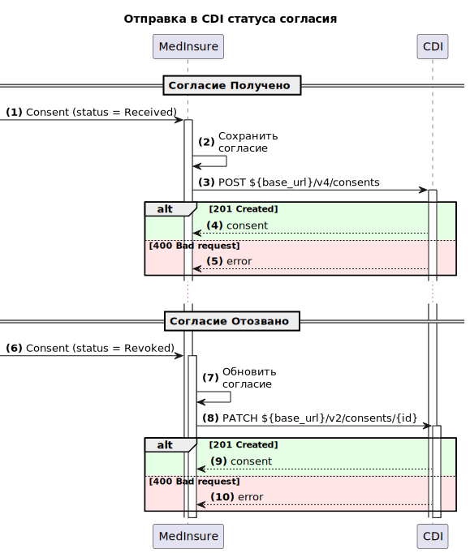

# Постановка задачи на интеграцию со смежной системой через REST API

**Легенда:**

Пользователь, оформляя согласие на обработку персональных данных через мобильное приложение, автоматически передает эти сведения в систему MedInsure, где они сохраняются в базе данных и прикрепляются к договору страхования, после чего информация направляется в CDI для интеграции в единый профиль клиента.

## Цель
- Обеспечить возможность синхронизации сведений о статусе согласия в системе MedInsure и едином профиле клиента

## Задачи
- Реализовать вызов метода REST API для передачи в CDI сведений о согласии по конкретному клиенту

### Диаграмма



### Описание шагов процесса

<table>
    <tr>
        <th>№</th>
        <th>Отправитель</th>
        <th>Получатель</th>
        <th>Направление</th>
        <th>Сообщение</th>
        <th>Комментарий</th>
    </tr>
    <tr>
        <td>1</td>
        <td>-</td>
        <td>MedInsure</td>
        <td>-</td>
        <td>Consent (status = Received)</td>
        <td>Получено согласие от внешнего источника</td>
    </tr>
    <tr>
        <td>2</td>
        <td>MedInsure</td>
        <td>MedInsure</td>
        <td>-</td>
        <td>Сохранить согласие</td>
        <td>Сохранить сведения о согласии в БД MedInsure</td>
    </tr>
    <tr>
        <td>3</td>
        <td>MedInsure</td>
        <td>CDI</td>
        <td><a href="#request">Запрос</a></td>
        <td>POST ${base_url}/v4/consents</td>
        <td>Отправка запроса на сохранение согласия пользователя в едином профиле клиента (CDI)</td>
    </tr>
    <tr>
        <td>4</td>
        <td>CDI</td>
        <td>MedInsure</td>
        <td><a href="#201-created">Ответ</a></td>
        <td>consent</td>
        <td>В ответе возвращаются сведения о сохраненном согласии с идентификатором в CDI</td>
    </tr>
    <tr>
        <td>5</td>
        <td>CDI</td>
        <td>MedInsure</td>
        <td><a href="#400-bad-request">Ответ</a></td>
        <td>error</td>
        <td>В ответе возвращаются сведения об ошибке</td>
    </tr>
    <tr>
        <td>6</td>
        <td>-</td>
        <td>MedInsure</td>
        <td>-</td>
        <td>Consent (status = Revoked)</td>
        <td>Отозвано согласие</td>
    </tr>
    <tr>
        <td>7</td>
        <td>MedInsure</td>
        <td>MedInsure</td>
        <td>-</td>
        <td>Обновить согласие</td>
        <td>Обновить сведения о согласии в БД MedInsure. Установить дату окончания действия согласия</td>
    </tr>
    <tr>
        <td>8</td>
        <td>MedInsure</td>
        <td>CDI</td>
        <td><a href="#request-1">Запрос</a></td>
        <td>PATCH ${base_url}/v2/consents/{id}</td>
        <td>Отправка запроса на обновлении сведений о согласии в едином профиле клиента (CDI)</td>
    </tr>
    <tr>
        <td>9</td>
        <td>CDI</td>
        <td>MedInsure</td>
        <td><a href="#200-ok">Ответ</a></td>
        <td>consent</td>
        <td>В ответе возвращаются сведения о сохраненном согласии с идентификатором в CDI</td>
    </tr>
    <tr>
        <td>10</td>
        <td>CDI</td>
        <td>MedInsure</td>
        <td><a href="#400-bad-request-1">Ответ</a></td>
        <td>error</td>
        <td>В ответе возвращаются сведения об ошибке</td>
    </tr>
</table>

#### Согласие «Получено»

<table>
    <tr>
        <th>Метод</th>
        <td>POST</td>
    </tr>
    <tr>
        <th>Хост</th>
        <td>https://example.cdi.com:8443</td>
    </tr>
    <tr>
        <th>endpoint</th>
        <td>/v4/consents</td>
    </tr>
</table>

##### Request

**headers**

<table>
    <tr>
        <th>№</th>
        <th>Системное имя</th>
        <th>Наименование</th>
        <th>Значение</th>
    </tr>
    <tr>
        <td>1</td>
        <td>Accept</td>
        <td>MIME-тип ожидаемого контента</td>
        <td>application/json</td>
    </tr>
    <tr>
        <td>2</td>
        <td>Content-Type</td>
        <td>MIME-тип отправляемого контента</td>
        <td>application/json</td>
    </tr>
</table>

**body**

<table>
    <tr>
        <th>№</th>
        <th>Системное имя</th>
        <th>Тип</th>
        <th>Наименование</th>
        <th>Источник</th>
        <th>Комментарий</th>
    </tr>
    <tr>
        <td>1</td>
        <td>sourceSystem</td>
        <td>string</td>
        <td>Код системы источника</td>
        <td>Значение "MDI"</td>
        <td></td>
    </tr>
    <tr>
        <td>2</td>
        <td>party</td>
        <td>object</td>
        <td>Пользователь</td>
        <td>-</td>
        <td></td>
    </tr>
    <tr>
        <td>2.1</td>
        <td>id</td>
        <td>string</td>
        <td>Идентификатор пользователя в MedInsure</td>
        <td>Таблица <b>mdi.parties</b> поле <b>party_id</b></td>
        <td></td>
    </tr>
    <tr>
        <td>2.2</td>
        <td>type</td>
        <td>string</td>
        <td>Тип пользователя</td>
        <td>Значение "PHYSICAL"</td>
        <td>PHYSICAL - Физическое лицо</td>
    </tr>
    <tr>
        <td>3</td>
        <td>consents</td>
        <td>array of objects</td>
        <td>Согласие</td>
        <td>-</td>
        <td></td>
    </tr>
    <tr>
        <td>3.1</td>
        <td>id</td>
        <td>string</td>
        <td>Идентификатор согласия в MedInsure</td>
        <td>Таблица <b>mdi.consents</b> поле <b>consent_id</b></td>
        <td></td>
    </tr>
    <tr>
        <td>3.2</td>
        <td>code</td>
        <td>string</td>
        <td>Код согласия из каталога согласий в CDI</td>
        <td>Значение "MDI001S"</td>
        <td></td>
    </tr>
    <tr>
        <td>3.3</td>
        <td>form</td>
        <td>string</td>
        <td>Форма предоставления согласия</td>
        <td>Значение "ELECTRONIC"</td>
        <td>ELECTRONIC - электронная форма предоставления в интерфейсе приложения</td>
    </tr>
    <tr>
        <td>3.4</td>
        <td>startDate</td>
        <td>string</td>
        <td>Дата начала действия</td>
        <td>Таблица <b>mdi.consents</b> поле <b>activate_at</b></td>
        <td>Формат dd.mm.yyyy hh:mm:ss</td>
    </tr>
    <tr>
        <td>3.5</td>
        <td>contractId</td>
        <td>string</td>
        <td>Идентификатор договора, в рамках которого предоставлено согласие</td>
        <td>Таблица <b>mdi.consents</b> поле <b>contract_id</b></td>
        <td></td>
    </tr>
</table>

<details>
    <summary>Пример Body</summary>

```json
{
    "sourceSystem": "MDI",
    "party": {
        "id": "36554f3f-bc5f-4a7f-9201-da7735ffb291",
        "type": "PHYSICAL"
    },
    "consents": [{
            "id": "873451d9-da42-4b10-b4ff-856aa1da6033",
            "code": "MDI001S",
            "form": "ELECTRONIC",
            "startDate": "01.01.2025 00:00:00",
            "contractId": "1e5119f8-5c3f-4462-81a5-11f1946e14d5"
        }
    ]
}

```
</details>

##### Response

###### 201 Created

**Согласие отправлено**

**body**

<table>
    <tr>
        <th>№</th>
        <th>Системное имя</th>
        <th>Тип</th>
        <th>Наименование</th>
    </tr>
    <tr>
        <td>1</td>
        <td>sourceSystem</td>
        <td>string</td>
        <td>Код системы источника</td>
    </tr>
    <tr>
        <td>2</td>
        <td>party</td>
        <td>object</td>
        <td>Пользователь</td>
    </tr>
    <tr>
        <td>2.1</td>
        <td>hid</td>
        <td>integer</td>
        <td>Идентификатор сущности пользователя в CDI</td>
    <tr>
        <td>2.2</td>
        <td>id</td>
        <td>string</td>
        <td>Идентификатор пользователя в MedInsure</td>
    </tr>
    <tr>
        <td>2.3</td>
        <td>type</td>
        <td>string</td>
        <td>Тип пользователя</td>
    </tr>
    <tr>
        <td>3</td>
        <td>consent</td>
        <td>array of objects</td>
        <td>Согласия</td>
    </tr>
    <tr>
        <td>3.1</td>
        <td>hid</td>
        <td>string</td>
        <td>Идентификатор сущности согласия в CDI</td>
    </tr>
    <tr>
        <td>3.2</td>
        <td>id</td>
        <td>string</td>
        <td>Идентификатор согласия в MedInsure</td>
    </tr>
    <tr>
        <td>3.3</td>
        <td>code</td>
        <td>string</td>
        <td>Код согласия из каталога согласий в CDI</td>
    </tr>
    <tr>
        <td>3.4</td>
        <td>form</td>
        <td>string</td>
        <td>Форма предоставления согласия</td>
    </tr>
    <tr>
        <td>3.5</td>
        <td>startDate</td>
        <td>string</td>
        <td>Дата начала действия</td>
    </tr>
    <tr>
        <td>3.6</td>
        <td>endDate</td>
        <td>string</td>
        <td>Дата начала действия</td>
    </tr>
    <tr>
        <td>3.7</td>
        <td>contractId</td>
        <td>string</td>
        <td>Идентификатор договора, в рамках которого предоставлено согласие</td>
    </tr>
</table>

<details>
    <summary>Пример Body</summary>

```json
{
    "sourceSystem": "MDI",
    "party": {
        "hid": 452618869,
        "id": "36554f3f-bc5f-4a7f-9201-da7735ffb291",
        "type": "PHYSICAL"
    },
    "consents": [{
            "hid": 155066,
            "id": "873451d9-da42-4b10-b4ff-856aa1da6033",
            "code": "MDI001S",
            "form": "ELECTRONIC",
            "startDate": "01.01.2025 00:00:00",
            "endDate": "",
            "contractId": "1e5119f8-5c3f-4462-81a5-11f1946e14d5"
        }
    ]
}

```
</details>

###### 400 Bad request

**body**

<table>
    <tr>
        <th>№</th>
        <th>Системное имя</th>
        <th>Тип</th>
        <th>Наименование</th>
    </tr>
    <tr>
        <td>1</td>
        <td>error</td>
        <td>object</td>
        <td>Сведения об ошибке</td>
    </tr>
    <tr>
        <td>1.1</td>
        <td>code</td>
        <td>string</td>
        <td>Код ошибки</td>
    </tr>
    <tr>
        <td>1.2</td>
        <td>message</td>
        <td>string</td>
        <td>Описание</td>
    </tr>
    <tr>
        <td>1.3</td>
        <td>details</td>
        <td>array of objects</td>
        <td>Дополнительные сведения</td>
    </tr>
    <tr>
        <td>1.3.1</td>
        <td>field</td>
        <td>string</td>
        <td>Наименование поля, в котором возникла ошибка</td>
    </tr>
    <tr>
        <td>1.3.2</td>
        <td>message</td>
        <td>string</td>
        <td>Текст подсказки</td>
    </tr>
</table>

<details>
    <summary>Пример body</summary>

```json
{
  "error": {
    "code": "VALIDATION_ERROR",
    "message": "Неверные параметры запроса",
    "details": [
      {
        "field": "sourceSystem",
        "message": "Неизвестный код системы"
      },
      {
        "field": "party.id",
        "message": "Пользователь с идентификатором 36554f3f-bc5f-4a7f-9201-da7735ffb291 не существует"
      },
      {
        "field": "consents[0].code",
        "message": "Неизвестный код согласия"
      },

    ]
  }
}
```
</details>

#### Согласие «Отозвано»

<table>
    <tr>
        <th>Метод</th>
        <td>PATCH</td>
    </tr>
    <tr>
        <th>Хост</th>
        <td>https://example.cdi.com:8443</td>
    </tr>
    <tr>
        <th>endpoint</th>
        <td>/v2/consents/{id}</td>
    </tr>
</table>

##### Request

**query-параметры**

<table>
    <tr>
        <th>№</th>
        <th>Системное имя</th>
        <th>Наименование</th>
        <th>Источник</th>
    </tr>
    <tr>
        <td>1</td>
        <td>id</td>
        <td>Идентификатор согласия в CDI</td>
        <td>Таблица <b>mdi.consents</b> поле <b>external_id</b></td>
    </tr>
</table>

**headers**

<table>
    <tr>
        <th>№</th>
        <th>Системное имя</th>
        <th>Наименование</th>
        <th>Значение</th>
    </tr>
    <tr>
        <td>1</td>
        <td>Accept</td>
        <td>MIME-тип ожидаемого контента</td>
        <td>application/json</td>
    </tr>
    <tr>
        <td>2</td>
        <td>Content-Type</td>
        <td>MIME-тип отправляемого контента</td>
        <td>application/json</td>
    </tr>
</table>

**body**

<table>
    <tr>
        <th>№</th>
        <th>Системное имя</th>
        <th>Тип</th>
        <th>Наименование</th>
        <th>Источник</th>
        <th>Комментарий</th>
    </tr>
    <tr>
        <td>1</td>
        <td>sourceSystem</td>
        <td>string</td>
        <td>Код системы источника</td>
        <td>Значение "MDI"</td>
        <td></td>
    </tr>
    <tr>
        <td>2</td>
        <td>consent</td>
        <td>object</td>
        <td>Согласие</td>
        <td>-</td>
        <td></td>
    </tr>
    <tr>
        <td>2.1</td>
        <td>endDate</td>
        <td>string</td>
        <td>Дата окончания действия</td>
        <td>Таблица <b>mdi.consents</b> поле <b>deactivate_at</b></td>
        <td>Формат dd.mm.yyyy hh:mm:ss</td>
    </tr>
</table>

<details>
    <summary>Пример Body</summary>

```json
{
    "sourceSystem": "MDI",
    "consent": {
            "endDate": "31.12.2025 00:00:00"
        }
}
```
</details>

##### Response

###### 200 OK

**Согласие отозвано**

**body**

<table>
    <tr>
        <th>№</th>
        <th>Системное имя</th>
        <th>Тип</th>
        <th>Наименование</th>
    </tr>
    <tr>
        <td>1</td>
        <td>sourceSystem</td>
        <td>string</td>
        <td>Код системы источника</td>
    </tr>
    <tr>
        <td>2</td>
        <td>consent</td>
        <td>array of objects</td>
        <td>Согласия</td>
    </tr>
    <tr>
        <td>2.1</td>
        <td>hid</td>
        <td>string</td>
        <td>Идентификатор сущности согласия в CDI</td>
    </tr>
    <tr>
        <td>2.2</td>
        <td>id</td>
        <td>string</td>
        <td>Идентификатор согласия в MedInsure</td>
    </tr>
    <tr>
        <td>2.3</td>
        <td>code</td>
        <td>string</td>
        <td>Код согласия из каталога согласий в CDI</td>
    </tr>
    <tr>
        <td>2.4</td>
        <td>form</td>
        <td>string</td>
        <td>Форма предоставления согласия</td>
    </tr>
    <tr>
        <td>2.5</td>
        <td>startDate</td>
        <td>string</td>
        <td>Дата начала действия</td>
    </tr>
    <tr>
        <td>2.6</td>
        <td>endDate</td>
        <td>string</td>
        <td>Дата начала действия</td>
    </tr>
    <tr>
        <td>2.7</td>
        <td>contractId</td>
        <td>string</td>
        <td>Идентификатор договора, в рамках которого предоставлено согласие</td>
    </tr>
</table>

<details>
    <summary>Пример Body</summary>

```json
{
    "sourceSystem": "MDI",
    "consent": [{
            "hid": 155066,
            "id": "873451d9-da42-4b10-b4ff-856aa1da6033",
            "code": "MDI001S",
            "form": "ELECTRONIC",
            "startDate": "01.01.2025 00:00:00",
            "endDate": "31.12.2025 00:00:00",
            "contractId": "1e5119f8-5c3f-4462-81a5-11f1946e14d5"
        }
    ]
}

```
</details>

###### 400 Bad request

**body**

<table>
    <tr>
        <th>№</th>
        <th>Системное имя</th>
        <th>Тип</th>
        <th>Наименование</th>
    </tr>
    <tr>
        <td>1</td>
        <td>error</td>
        <td>object</td>
        <td>Сведения об ошибке</td>
    </tr>
    <tr>
        <td>1.1</td>
        <td>code</td>
        <td>string</td>
        <td>Код ошибки</td>
    </tr>
    <tr>
        <td>1.2</td>
        <td>message</td>
        <td>string</td>
        <td>Описание</td>
    </tr>
    <tr>
        <td>1.3</td>
        <td>details</td>
        <td>array of objects</td>
        <td>Дополнительные сведения</td>
    </tr>
    <tr>
        <td>1.3.1</td>
        <td>field</td>
        <td>string</td>
        <td>Наименование поля, в котором возникла ошибка</td>
    </tr>
    <tr>
        <td>1.3.2</td>
        <td>message</td>
        <td>string</td>
        <td>Текст подсказки</td>
    </tr>
</table>

<details>
    <summary>Пример body</summary>

```json
{
  "error": {
    "code": "VALIDATION_ERROR",
    "message": "Неверные параметры запроса",
    "details": [
      {
        "field": "sourceSystem",
        "message": "Неизвестный код системы"
      },
      {
        "field": "consent.endDate",
        "message": "Дата окончания действия должна быть больше даты начала действия"
      }
    ]
  }
}
```
</details>

###### 404 Not found

**body**

<table>
    <tr>
        <th>№</th>
        <th>Системное имя</th>
        <th>Тип</th>
        <th>Наименование</th>
    </tr>
    <tr>
        <td>1</td>
        <td>error</td>
        <td>object</td>
        <td>Сведения об ошибке</td>
    </tr>
    <tr>
        <td>1.1</td>
        <td>code</td>
        <td>string</td>
        <td>Код ошибки</td>
    </tr>
    <tr>
        <td>1.2</td>
        <td>message</td>
        <td>string</td>
        <td>Описание</td>
    </tr>
</table>

<details>
    <summary>Пример body</summary>

```json
{
  "error": {
    "code": "NOT_FOUND",
    "message": "Соглашение не найдено"
  }
}
```
</details>