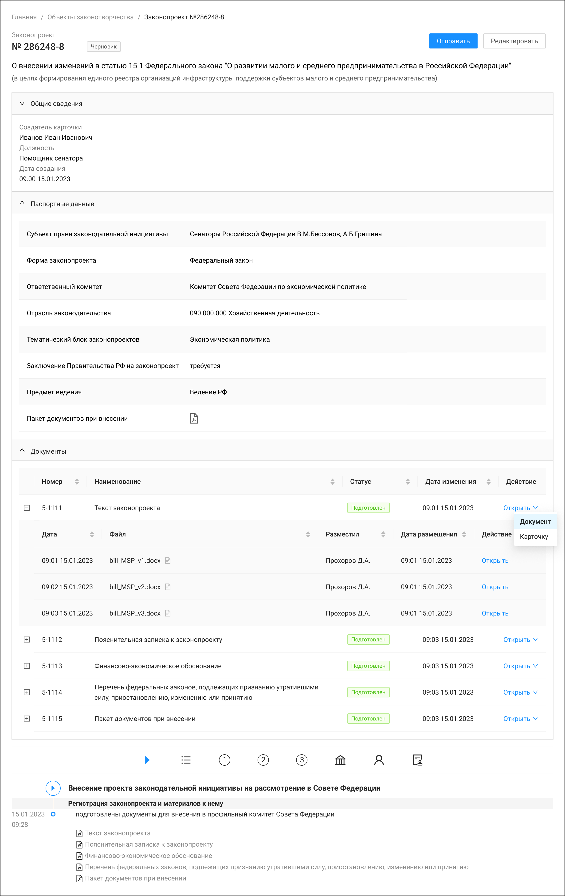
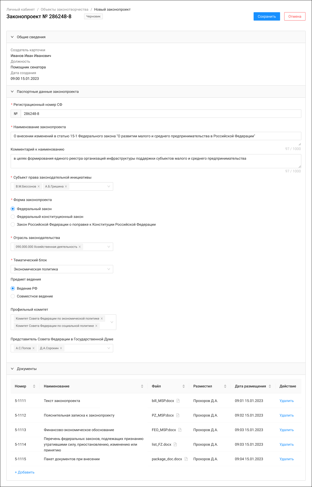
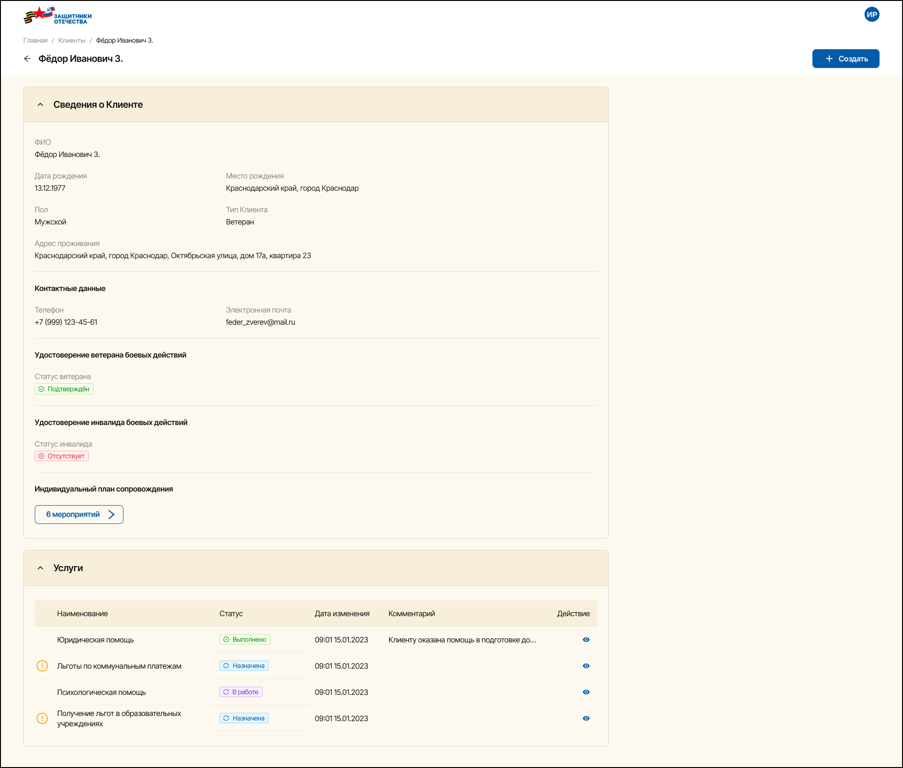
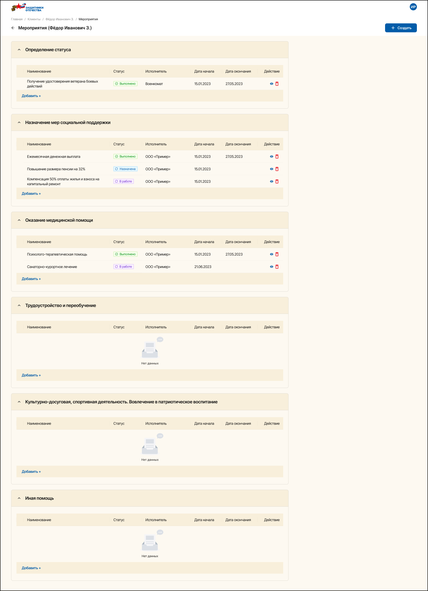
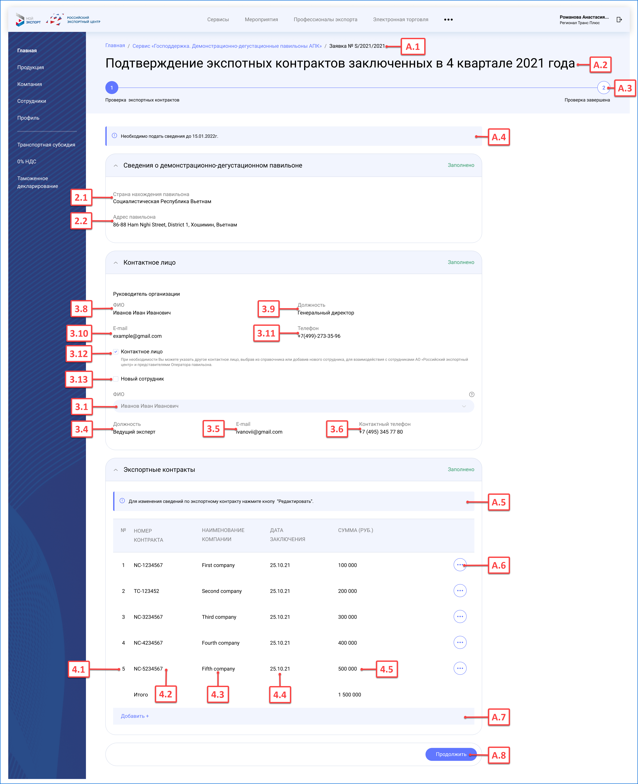

# Описание экранных форм

## Примеры в Figma

### Карточка законопроекта 

**Легенда:**

Сенатор РФ, используя право законодательной инициативы, разрабатывает законопроект. Для его внесения в Госдуму требуется подготовить карточку проекта с документами и получить предварительное одобрение Совета Федерации.

#### Ссылка

[Figma](https://www.figma.com/design/mdG8MXmkOzVFLnSZtuQ9qp/%D0%A1%D0%A4-%D0%97%D0%B0%D0%BA%D0%BE%D0%BD%D0%BE%D0%BF%D1%80%D0%BE%D0%B5%D0%BA%D1%82?node-id=0-1&t=KHoIExf7S3EsQJEt-1)

    
Карточка законопроекта. Режим просмотра

    
Карточка законопроекта. Режим редактирования

### Сопровождение ветерана боевых действий

**Легенда:**

Социальный координатор помогает ветеранам получить полагающиеся виды помощи, включая медицинскую реабилитацию, лекарственное обеспечение, психологическую поддержку, ТСР, санаторное лечение, переобучение и трудоустройство. Информация вносится в систему со слов ветерана с последующей проверкой документов при необходимости

#### Ссылка

Карта экранов в [figma](https://www.figma.com/design/9oHQjI7MF9fzLiMEytvafY/%D0%A4%D0%97%D0%9E?node-id=605-32246&t=aly24myff9Ut6EBe-1)

    
Сведения о ветеране

    
Детализация услуг

## Описание макетов в СТ

**Легенда:**

По итогам года экспортёр должен предоставить отчёт о результатах размещения продукции в павильоне. Документ формируется автоматически на основе данных оператора, после чего экспортёру необходимо проверить перечень заключённых контрактов и их общую сумму, при необходимости дополнив или скорректировав сведения перед подачей

### Отчёт экспортёра. Подтверждение экспортных контрактов

| №    | Наименование                | Тип        | Краткое описание                                                                                                                                                    |
| ---- | --------------------------- | ---------- | ------------------------------------------------------------------------------------------------------------------------------------------------------------------- |
| А.1  | Навигационная цепочка       | Breadcrumb | Элемент интерфейса, показывающий путь к странице, которую в данный момент просматривает пользователь                                                                |
| А.2  | Отчётный период             | Text       | Отчётный период, за который подаются сведения о контрактах                                                                                                          |
| А.3  | Степпер                     | Steps      | Элемент интерфейса, показывающий перечень шагов которые необходимо пройти для подачи сведений о контрактах, а так же текущий шаг на котором находится пользователь. |
| А.4  | Срок подачи                 | Alert      | Уведомление о сроках подачи                                                                                                                                         |
| А.5  | Подсказа по редактированию  | Alert      | Подсказка пользователю                                                                                                                                              |
| А.6  | Действие по контракту       | Button     | Вызов меню для редактирования сведений о контракте или удаления контракта из отчёта                                                                                 |
| А.7  | Добавить                    | Button     | Вызов модального окна для внесения сведений об экспортном контракте                                                                                                 |
| А.8  | Продолжить                  | Button     | Кнопка перехода к следующей экранной форме                                                                                                                          |
| 2.1  | Страна нахождения павильона | Text       | Наименование страны, в которой была размещена продукция                                                                                                             |
| 2.2  | Адрес павильона             | Text       | Адрес размещения павильона                                                                                                                                          |
| 3.1  | ФИО                         | Select     | Имя лица, через которое происходит общение с экспортёром                                                                                                            |
| 3.5  | Должность                   | Text       | Должность контактного лица                                                                                                                                          |
| 3.6  | E-mail                      | Text       | Адрес электронной почты контактного лица                                                                                                                            |
| 3.7  | Контактный телефон          | Text       | Телефонный номер контактного лица                                                                                                                                   |
| 3.8  | Руководитель (ФИО)          | Text       | Имя руководителя организации экспортёра                                                                                                                             |
| 3.9  | Должность руководителя      | Text       | Должность руководителя организации экспортёра                                                                                                                       |
| 3.10 | E-mail руководителя         | Text       | Адрес электронной почты организации руководителя экспортёра                                                                                                         |
| 3.11 | Телефон руководителя        | Text       | Телефонный номер руководителя                                                                                                                                       |
| 3.12 | Контактное лицо             | Checkbox   | Признак наличия иного контактного лица                                                                                                                              |
| 3.13 | Новый сотрудник             | Checkbox   | Признак указания нового сотрудника                                                                                                                                  |